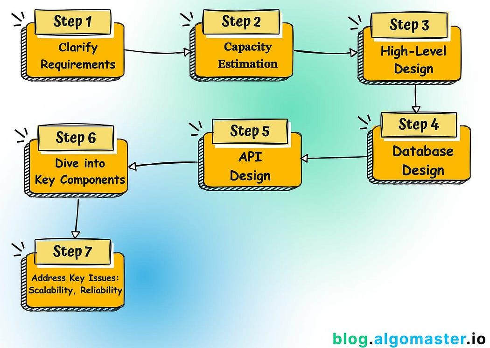
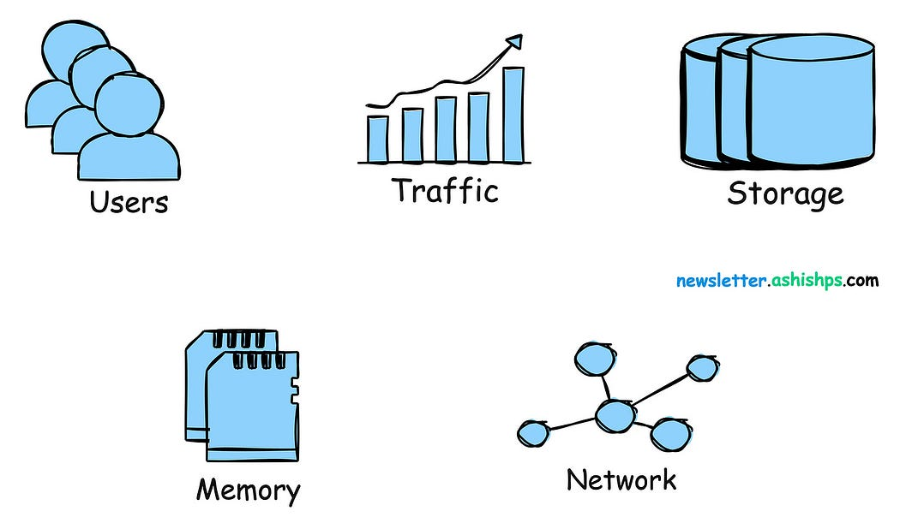
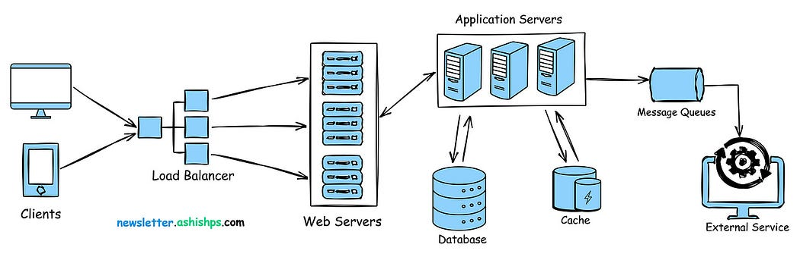
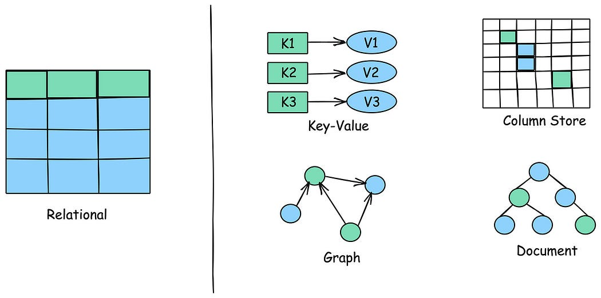
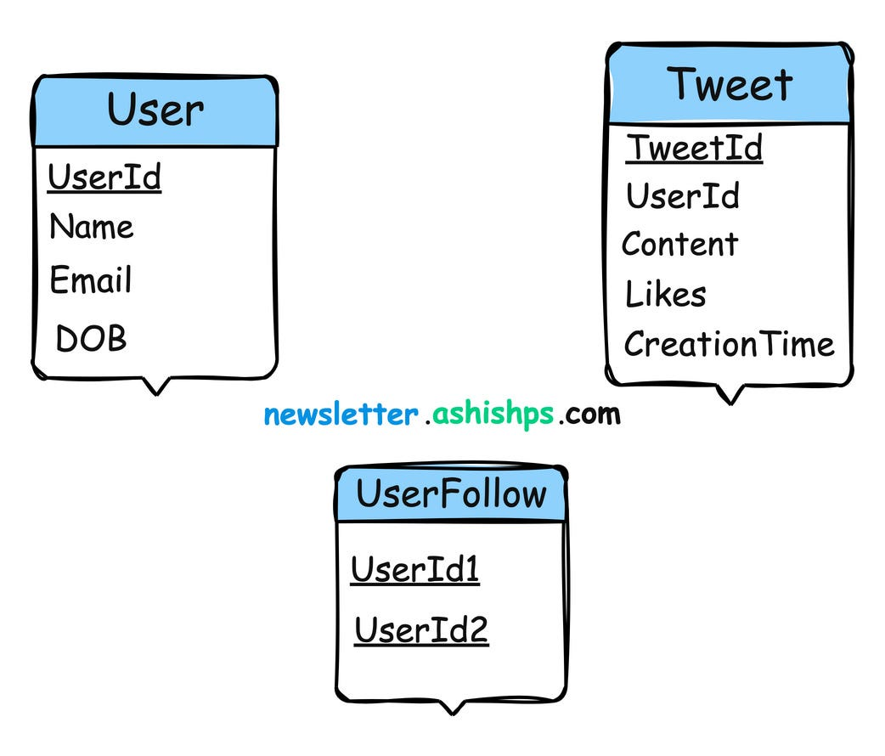
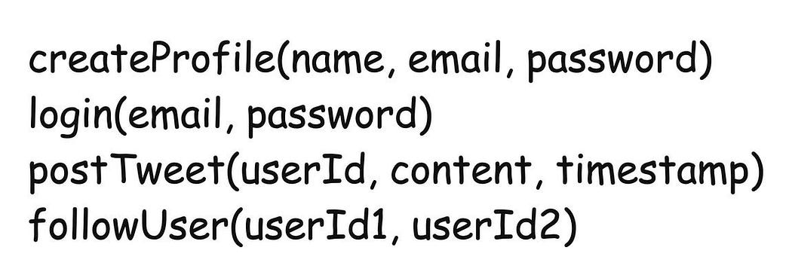
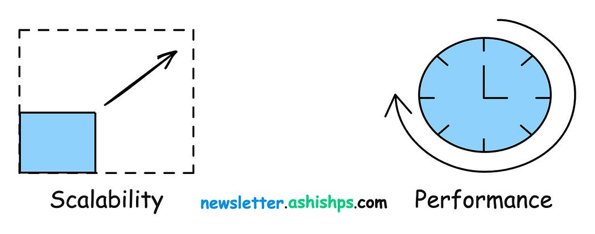
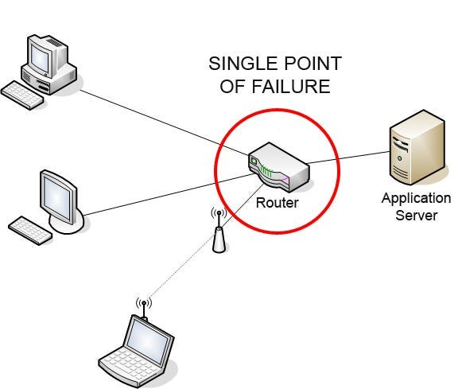

# A Step-by-Step Guide to System Design Interviews

System design interviews can be one of the most challenging but with a
structured approach, you can navigate these interviews more effectively.

In this article, we will explore detailed step-by-step approach to
tackle system design problems effectively in an interview setting.

**Step 1: Clarify Requirements**

The first step in approaching a system design problem is to
thoroughly **understand the problem statement**, clarify any ambiguities
and gather as much information as possible about the system you’re being
asked to design.

Listen attentively to the interviewer and ask questions to identify all
the key features and functionalities expected from the system.

There are two types of requirements you should aim to
clarify: **functional** and **non-functional**.

Best way to clarify these requirements is to ask relevant questions.

**Functional Requirements:**

- What are the core features that the system should support?

- Are there any particular features that are more critical than
  others?

- Who will use this system (customers, internal teams etc..)?

- What specific actions should users be able to perform on the system?

- How will users interact with the system (web, mobile app, API,
  etc.)?

- Does the system need to support multiple languages or locales?

- What are the key data types the system must handle (text, images,
  structured data, etc). It can influence your database choices.

- Are there any external systems or third-party services the system
  needs to integrate with?

**Non-functional Requirements:**

- What is the expected scale of the system in terms of users and
  requests?

- How much data volume is expected to be handled by the system?

- What are the inputs and outputs of the system?

- What is the expected read-to-write ratio?

- Can the system have some downtime, or does it need to be highly
  available?

- Are there any specific latency requirements?

- How critical is data consistency? Can some eventual consistency be
  tolerated for the sake of availability?

- Are there any specific non-functional requirements (performance,
  scalability, reliability) we should focus on?

Understanding the scope early prevents you from heading in the wrong
direction.

**Step 2: Capacity Estimation**

After clarifying the requirements, it is important to estimate the
capacity of the system you are going to design.

Estimating the scale upfront helps guide your design decisions and
ensures that the system can meet the desired criteria.

This can include things like expected daily/monthly users, read/write
requests per second, data storage and network bandwidth needs.

- **Users: **Estimate the number of daily users and maximum concurrent
  users during peak hours.

- **Traffic:** Calculate expected read/write per second. Consider peak
  traffic periods and potential spikes in usage.

- **Storage:** Consider the different types of data (structured,
  unstructured, multimedia) and estimate the total amount of storage
  required (and its growth rate).

- **Memory: **Evaluate the potential benefits of caching to reduce
  latency and improve performance.\*\* \*\*Estimate how much memory you
  might need to store frequently accessed data.

- **Network: **Estimate bandwidth requirements based on the estimated
  traffic volume and data transfer sizes.

Consider future growth and scalability requirements to ensure the system
can handle increased load over time.

**Step 3: High-Level Design**

With the requirements and expected capacity in mind, start designing the
high-level architecture of the system.

Break down the system into major components or modules, such as the
frontend, backend, databases, caches, and external services.

Draw a simple **block diagram** that outlines the major system
components and the high-level flow of data and requests through the
system, from the client to the backend and back.

**What to Include in Your Diagram**

- **Client Applications: **Indicates how users will interact with the
  system (web browser, mobile app, desktop application etc.).

- **Web Servers: **Servers that handle incoming requests from clients.

- **Load Balancers: **Used to evenly distribute traffic to servers to
  handle significant traffic.

- **Application Services: **The backend logic layer where the core
  functionalities of the system are implemented.

- **Databases: **Specify the type of database: SQL vs. NoSQL, and
  briefly explain why.

- **Caching Layer: **Specify caching (eg.. Redis, Memcached) if you’re
  using to reduce load on the database.

- **Message Queues: **If using asynchronous communication.

- **External Services: **If the system relies on third-party APIs
  (e.g., payment gateways), include them.

For every component, make sure to consider trade-offs and justify why
you picked specific technologies or architectures (e.g., “We need strong
consistency, so a relational database is a good fit”).

**Tips to Approach Drawing High-Level Diagram:**

- Keep it simple and clean.

- Use appropriate notations and symbols to represent the components,
  their interactions, and the data flow.

- Use different colors, line styles, or symbols to differentiate
  between various types of components or interactions.

- Stick with simple boxes representing components and arrows showing
  directional data flow.

- Show how data flows through the system, from input to storage and
  retrieval using arrows.

- Avoid cluttering the diagram with too much detail or unnecessary
  elements.

- Don’t overthink the minor details, this is about the big picture.

**Step 4: Database Design**

This steps involve modeling the data, choosing the right storage for the
system, designing the database schema and optimizing the storage and
retrieval of data based on the access patterns.

**Data Modeling**

- Identify the main data entities or objects that the system needs to
  store and manage (e.g., users, products, orders).

- Consider the relationships between these entities and how they
  interact with each other.

- Determine the attributes or properties associated with each entity
  (e.g., a user has an email, name, address).

- Identify any unique identifiers or primary keys for each entity.

- Consider normalization techniques to ensure data integrity and
  minimize redundancy.

**Choose the Right Storage**

- Evaluate the requirements and characteristics of the data to
  determine the most suitable database type.

- Consider factors such as data structure, scalability, performance,
  consistency, and query patterns.

- Relational databases (e.g., MySQL, PostgreSQL) are suitable for
  structured data with complex relationships and ACID properties.

- NoSQL databases (e.g., MongoDB, Cassandra) are suitable for
  unstructured or semi-structured data, high scalability, and eventual
  consistency.

- Consider using a combination of databases if different data subsets
  have distinct requirements.

**Design the Database Schema**

**Example:** Twitter Database schema for storing user and tweets

- Define the tables, columns, data types, and relationships based on
  the chosen database type.

- Specify primary keys, foreign keys, and any necessary indexes to
  optimize query performance.

- Consider denormalization techniques, such as duplication or
  pre-aggregation, to improve read performance if needed.

**Define Data Access Patterns**

- Identify the common data access patterns and queries that the system
  will perform.

- Optimize the database schema and indexes based on these access
  patterns to ensure efficient data retrieval.

- Use appropriate caching mechanisms to store frequently accessed data
  and reduce database load.

- For scalability, consider partitioning or sharding your data across
  multiple databases or tables.

**Step 5: Design API and Communication Protocols**

Designing the API (Application Programming Interface) and communication
protocols defines how different components of the system interact with
each other and how external clients can access the system’s
functionality.

**Identify the API Requirements:**

- Determine the main functionalities and services that the system
  needs to expose through the API.

- Consider the different types of clients (e.g., web, mobile,
  third-party services) that will interact with the API.

- Identify the data inputs, outputs, and any specific requirements for
  each API endpoint.

**Choose the API Style:**

- Select an appropriate API style based on the system’s requirements
  and the clients’ needs.

- RESTful APIs (Representational State Transfer) are commonly used for
  web-based systems and provide a uniform interface for resource
  manipulation.

- GraphQL APIs offer a flexible and efficient approach for clients to
  query and retrieve specific data fields.

- RPC (Remote Procedure Call) APIs are suitable for systems with
  well-defined procedures or functions.

**Define the API Endpoints:**

**Example:** Twitter APIs

- Design clear and intuitive API endpoints based on the system’s
  functionalities and data model.

- Use appropriate HTTP methods (e.g., GET, POST, PUT, DELETE) for each
  endpoint to indicate the desired action.

**Specify the Data Formats:**

- Choose the data formats for the API requests and responses.

- Common formats include JSON (JavaScript Object Notation) and XML
  (eXtensible Markup Language).

- Consider factors such as readability, parsing efficiency, and
  compatibility with the clients and system components.

**Choose Communication Protocols:**

- **HTTPS:** Commonly used for RESTful APIs and web-based
  communication.

- **WebSockets: **Useful for real-time, bidirectional communication
  between clients and servers (e.g., chat applications).

- **gRPC (gRPC Remote Procedure Call): **Efficient for inter-service
  communication in microservices architectures.

- **Messaging Protocols:** AMQP, MQTT for asynchronous messaging
  (often used with message queues).

**Step 6: Dive Deeper into Key Components**

Your interviewer will likely want to focus on specific areas so pay
attention and discuss those things in more detail.

**Common Areas for Deep Dives:**

- **Databases:** How would you handle a massive increase in data
  volume? Discuss sharding (splitting data across multiple databases),
  replication (read/write replicas).

- **Web Servers/Application Servers:** How do you add more servers
  behind the load balancer for increased traffic?

- **Load Balancers: **Which Load Balancing techniques and algorithms
  to use (e.g., round-robin, least connections).

- **Caching:** Where would you add more cache layers (in front of web
  servers? in the application layer?), and how would you deal with
  cache invalidation?

- **Single Points of Failure:** Identify components whose failure
  would take down the system and discuss how to address it.

- **Authentication/Authorization:** How would you manage user access
  and permissions securely?

- **Rate Limiting:** How would you prevent excessive use or abuse of
  your APIs?

**Step 7: Address Key Issues**

This step involves identifying and addressing the core challenges that
your system design is likely to encounter.

These challenges can range from scalability and performance to
reliability, security, and cost concerns.

**Addressing Scalability and Performance Concerns:**

- **Scale horizontally (Scale-out)** by adding more nodes and use load
  balancers to evenly distribute the traffic among the nodes.

- **Scale vertically (Scale-up)** by increasing the capacity of
  individual resources (e.g., CPU, memory, storage).

- **Implement caching** to reduce the load on backend systems and
  improve response times.

- Select efficient data structures and algorithms for critical
  operations.

- **Optimize** database queries and indexes.

- **Denormalize data** when necessary to reduce join operations.

- Use **database partitioning** and **sharding** for improved query
  performance.

- Implement **content delivery networks (CDNs)** to serve static
  assets from geographically distributed servers.

- Utilize **asynchronous programming** models to handle concurrent
  requests efficiently.

**Addressing Reliability**

Reliability refers to a system’s ability to function correctly and
consistently, even in the presence of failures or errors.

Credit: <https://en.wikipedia.org/wiki/Single_point_of_failure>

Here are some key considerations for making our system more reliable:

- Analyze the system architecture and identify potential **single
  point of failures.**

- Design **redundancy** into the system components (multiple load
  balancers, database replicas) to eliminate single points of failure.

- Consider **geographical redundancy** to protect against regional
  failures or disasters.

- Implement **data replication** strategies to ensure data
  availability and durability.

- Implement **circuit breaker** patterns to prevent cascading failures
  and protect the system from overload.

- Implement **retry mechanisms** with exponential backoff to handle
  temporary failures and prevent overwhelming the system during
  recovery.

- Implement comprehensive **monitoring and alerting systems** to
  detect failures, performance issues, and anomalies.

Remember, the goal is not to provide a flawless solution but to showcase
your ability to break down problems, make well-reasoned design
decisions, and communicate your thought process clearly.

These 7 steps should guide you to remain on track and cover all the
different aspects when answering a system design interview problem.

Thank you so much for reading.

If you found it valuable, hit the clap button 👏 and consider following
me for more such content.

If you have any questions or suggestions, leave a comment.

Join my [**Free Newsletter**](https://blog.algomaster.io/) for weekly
articles on coding, dsa, system design and interviews.

Checkout my **Youtube channel** for more in-depth content.

Checkout my [**GitHub repositories**](https://github.com/ashishps1) for
free interview preparation resources.

I hope you have a lovely day!

See you soon,

Ashish

_Originally published
at [https://blog.algomaster.io](https://blog.algomaster.io/p/how-to-answer-a-system-design-interview-problem)._
