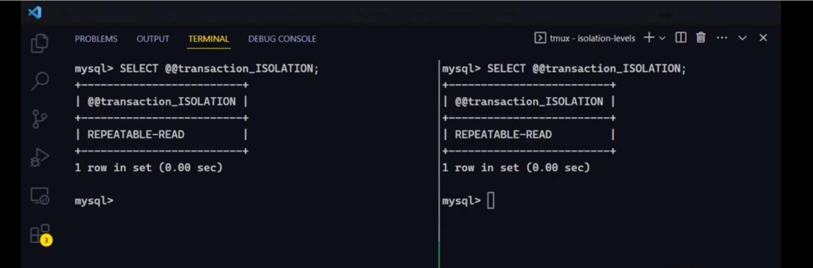
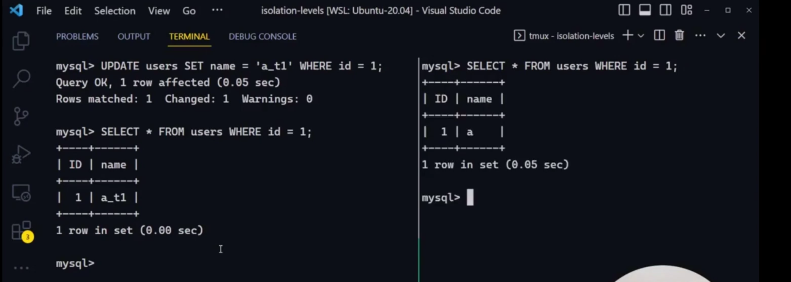
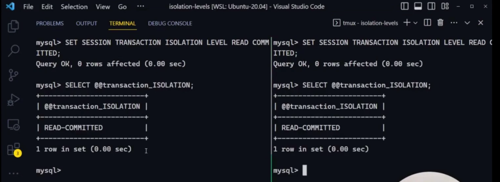
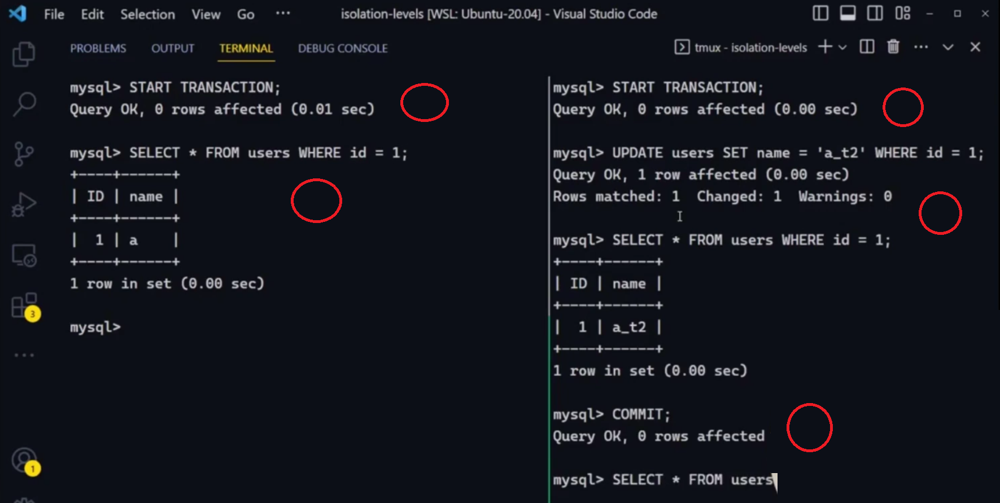

# Isolation levels

Isolation levels in a database define the degree to which the operations in one transaction are isolated from those in other concurrent transactions. They are critical for managing **concurrency control** and ensuring data integrity when multiple transactions are executed simultaneously. These levels balance between consistency and performance, affecting how data changes made by one transaction are visible to other transactions.

Here are the four standard isolation levels defined by the **SQL standard**:

### 1. **Read Uncommitted**

- **Description**: The lowest isolation level where transactions can see uncommitted changes made by other transactions.
- **Advantages**: High performance, as it avoids many locking mechanisms.
- **Disadvantages**: It can lead to issues like **dirty reads**, where a transaction reads data that might later be rolled back by the transaction that made the changes.
- **Use Cases**: Scenarios where high throughput is more important than data accuracy.

### 2. **Read Committed**

- **Description**: A transaction can only see changes committed by other transactions. Uncommitted data is not visible.
- **Advantages**: Prevents dirty reads.
- **Disadvantages**: **Non-repeatable reads** can still occur. This means that if a transaction reads the same row twice, the data may have changed between the two reads.
- **Use Cases**: Systems where consistency is important but high throughput is still necessary, like many OLTP systems.

### 3. **Repeatable Read**

- **Description**: Ensures that if a transaction reads a value, no other transaction can modify or delete that value until the current transaction is complete.
- **Advantages**: Prevents dirty reads and non-repeatable reads.
- **Disadvantages**: **Phantom reads** can still occur, where a transaction reads a set of rows that match a condition, but a new row matching the condition is inserted by another transaction.
- **Use Cases**: Scenarios where strong consistency is required, such as financial systems.

### 4. **Serializable**

- **Description**: The highest isolation level, which ensures complete isolation. Transactions are executed in such a way that they appear to be serially executed, one after another.
- **Advantages**: Prevents all concurrency issues, including dirty reads, non-repeatable reads, and phantom reads.
- **Disadvantages**: Lowest performance due to extensive locking and reduced concurrency.
- **Use Cases**: Systems where accuracy and consistency are critical, even at the cost of performance, such as in certain banking and financial systems.

### Common Anomalies Addressed by Isolation Levels

- **Dirty Read**: Reading uncommitted changes made by another transaction.
- **Non-repeatable Read**: Data that was read once is modified by another transaction, causing a different result if read again.
- **Phantom Read**: New rows are inserted or deleted by another transaction, causing the results of a query to change.

### Summary Table

| Isolation Level  | Dirty Read | Non-repeatable Read | Phantom Read |
| ---------------- | ---------- | ------------------- | ------------ |
| Read Uncommitted | Yes        | Yes                 | Yes          |
| Read Committed   | No         | Yes                 | Yes          |
| Repeatable Read  | No         | No                  | Yes          |
| Serializable     | No         | No                  | No           |

These isolation levels help maintain the balance between **data integrity** and **system performance** depending on the application’s needs.

| **Isolation Level**  | **Dirty Read** | **Non-repeatable Read** | **Phantom Read** | **Description**                                                                                | **Use Case**                                                                                            |
| -------------------- | -------------- | ----------------------- | ---------------- | ---------------------------------------------------------------------------------------------- | ------------------------------------------------------------------------------------------------------- |
| **Read Uncommitted** | Yes            | Yes                     | Yes              | Transactions can see uncommitted changes. High performance but risky due to dirty reads.       | High throughput is more important than data accuracy.                                                   |
| **Read Committed**   | No             | Yes                     | Yes              | Transactions only see committed changes. Prevents dirty reads but allows non-repeatable reads. | Systems requiring reasonable consistency without sacrificing performance, e.g., OLTP systems.           |
| **Repeatable Read**  | No             | No                      | Yes              | Ensures consistent reads for a transaction, but allows phantom reads.                          | Strong consistency needed, like in financial applications.                                              |
| **Serializable**     | No             | No                      | No               | Highest isolation level, ensuring full isolation and preventing all concurrency issues.        | Systems where data accuracy is critical, such as banking systems, but performance is less of a concern. |

## DEMO

### Create two sessions and get status

- **Set automcommit to zero in both sessions**
  

## Start a transaction in both the sessions



- A record is updated **Session 1** but not comitted


# Set Isolation Level



### Start Transaction


TODO: 9:24

# ChatGPT

Sure! Here's a simple illustration with **two sessions (transactions)** to show how different isolation levels affect reads and writes. This will demonstrate concepts like **dirty reads**, **non-repeatable reads**, and **phantom reads**.

---

### **Scenario Setup**

We have a table `accounts` with a single row:

```sql
| account_id | balance |
|------------|---------|
| 1          | 1000    |
```

---

### **Dirty Read Example (Read Uncommitted)**

| **Session 1 (T1)**                                        | **Session 2 (T2)**                                                      |
| --------------------------------------------------------- | ----------------------------------------------------------------------- |
| Begins Transaction                                        |                                                                         |
| `UPDATE accounts SET balance = 500 WHERE account_id = 1;` |                                                                         |
| **Balance is now 500, but the change is not committed.**  |                                                                         |
|                                                           | Begins Transaction                                                      |
|                                                           | **Reads balance:** `SELECT balance FROM accounts WHERE account_id = 1;` |
|                                                           | **Sees balance as 500 (dirty read)**                                    |
| `ROLLBACK;` (No commit, rollback to 1000)                 |                                                                         |
|                                                           | **Balance now back to 1000, but T2 read 500.**                          |
|                                                           |                                                                         |

- **Dirty Read**: In `Read Uncommitted` isolation level, T2 reads the uncommitted change made by T1. Later, T1 rolls back the change, but T2 has already seen incorrect data.

---

### **Non-repeatable Read Example (Read Committed)**

| **Session 1 (T1)**                                        | **Session 2 (T2)**                                                            |
| --------------------------------------------------------- | ----------------------------------------------------------------------------- |
| Begins Transaction                                        | Begins Transaction                                                            |
|                                                           | **Reads balance:** `SELECT balance FROM accounts WHERE account_id = 1;`       |
|                                                           | **Sees balance as 1000.**                                                     |
| `UPDATE accounts SET balance = 500 WHERE account_id = 1;` |                                                                               |
| `COMMIT;` (Change is now committed)                       |                                                                               |
|                                                           | **Reads balance again:** `SELECT balance FROM accounts WHERE account_id = 1;` |
|                                                           | **Sees balance as 500 (non-repeatable read)**                                 |

- **Non-repeatable Read**: In `Read Committed` isolation level, T2 reads the data once and gets 1000, but after T1 commits its change, a second read returns 500. The data has "changed" between reads within the same transaction.

---

### **Phantom Read Example (Repeatable Read)**

| **Session 1 (T1)**                                            | **Session 2 (T2)**                            |
| ------------------------------------------------------------- | --------------------------------------------- |
| Begins Transaction                                            | Begins Transaction                            |
|                                                               | `SELECT * FROM accounts WHERE balance > 500;` |
|                                                               | **Sees no rows.**                             |
| `INSERT INTO accounts (account_id, balance) VALUES (2, 600);` |                                               |
| `COMMIT;`                                                     |                                               |
|                                                               | `SELECT * FROM accounts WHERE balance > 500;` |
|                                                               | **Sees newly inserted row (phantom read)**    |

- **Phantom Read**: In `Repeatable Read` isolation level, T2 initially sees no rows where `balance > 500`, but after T1 inserts a new row and commits, a subsequent query returns a new row matching the condition. The data has changed, but not in the same way as non-repeatable reads—it’s a “phantom” row that didn’t exist before.

---

### **Serializable Isolation (No Dirty, Non-repeatable, or Phantom Reads)**

In **Serializable isolation level**, all the above issues are prevented because:

- T1 and T2 cannot interfere with each other in ways that cause dirty, non-repeatable, or phantom reads.
- T2 will block and wait for T1 to complete its changes (or vice versa), ensuring the transactions behave as though they were executed serially.

  

---

This example should clarify the difference between dirty reads, non-repeatable reads, and phantom reads under various isolation levels.

[start_transaction_in_both_the_sessions](./images/start_transaction_in_both_the_sessions.png)
