# Arpit Bhayani - The System Design Masterclass 2022-6

System Design Introduction Basics

1.  Course Introduction.mp4
2.  What is System Design.mp4
    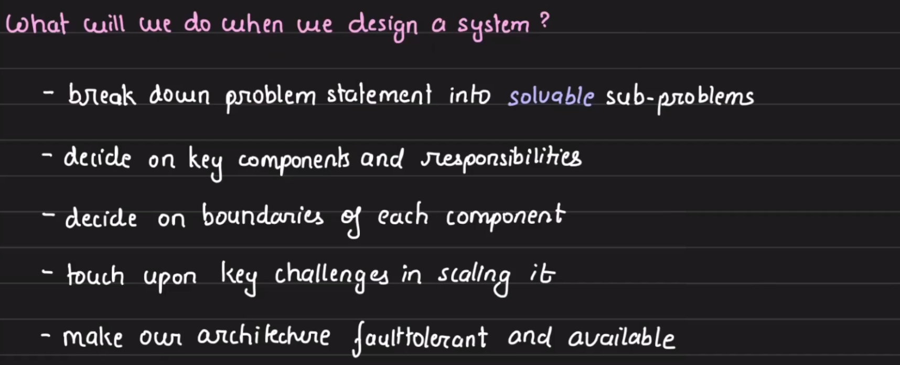
3.  How to approach system design.mp4

    - Understand the problem statement
    - Break down into componenets
      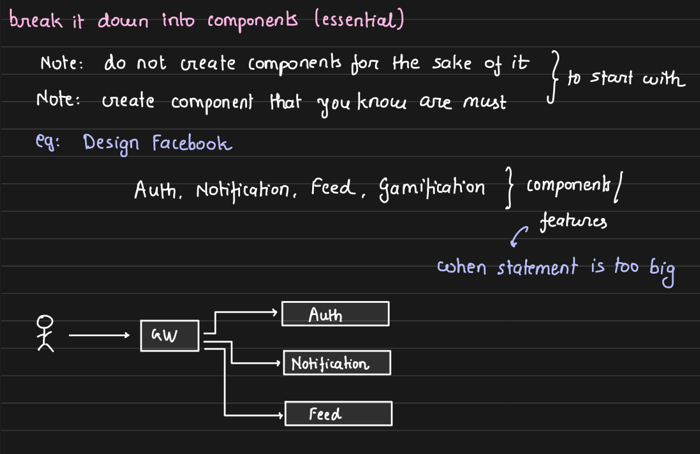
    - Dissect each component
      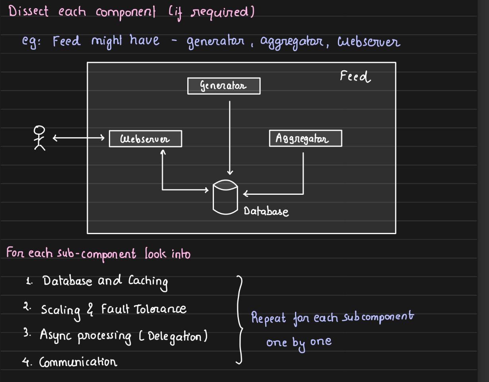
      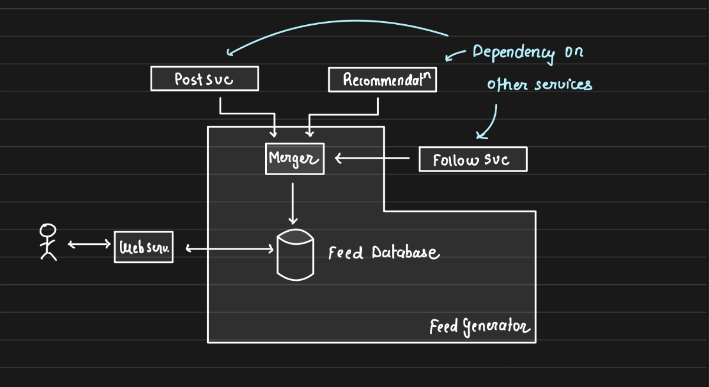

4.  How do you evaluate that you have built a good system.mp4

    - Every system is <mark>infinitely</mark> buildable hence knowing when to stop evolution is important.
    - 1. Break System into components
    - 2. Every system has clear responsibilitities (exclusive scope)
         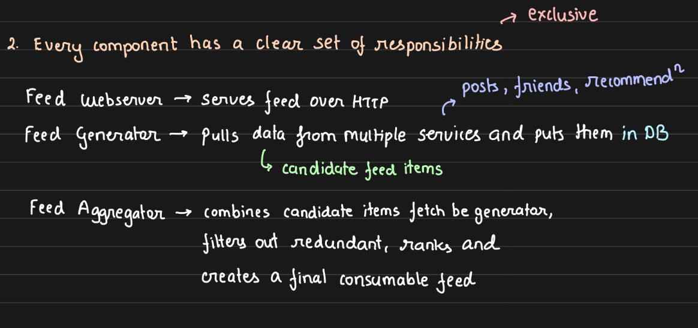
    - 3. For each component slight details are figured out.
         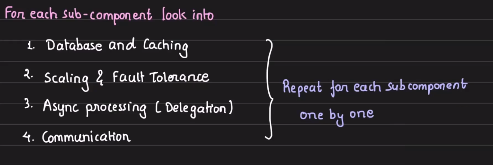
    - 4. Each component ( in isolation ) is :
      - Scalable
      - Fault tolerant
      - Available
        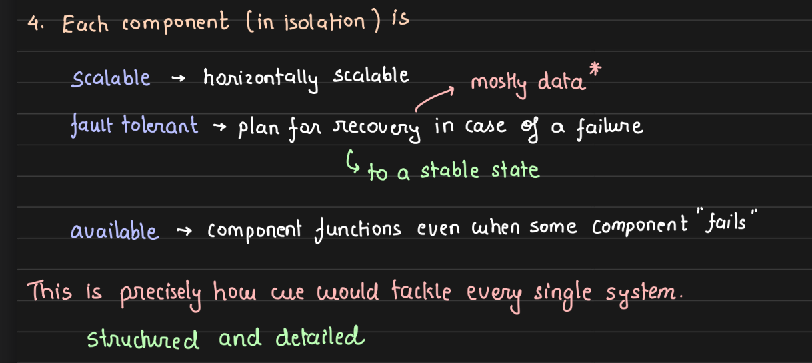

5.  Relational Databases.mp4
    Key properties of Relational Databases are

    1.  Data consistenty
    2.  Data durability
    3.  Data integrity
    4.  Constraints
    5.  Everthing in one Place

    - ACID
    - 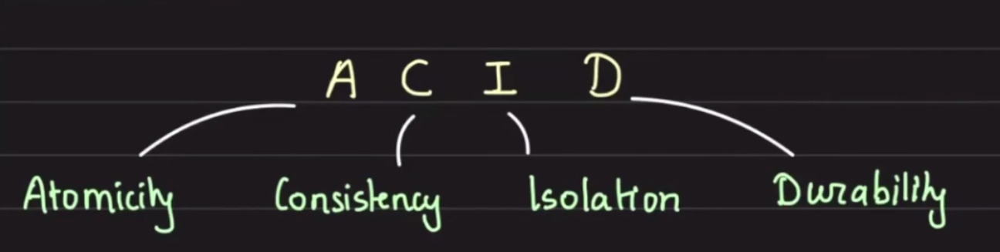

      - Atomicity - All statements within a transaction take effect or none.
      - Consistency - Data will never go incorrect
      - Isolation -
      - 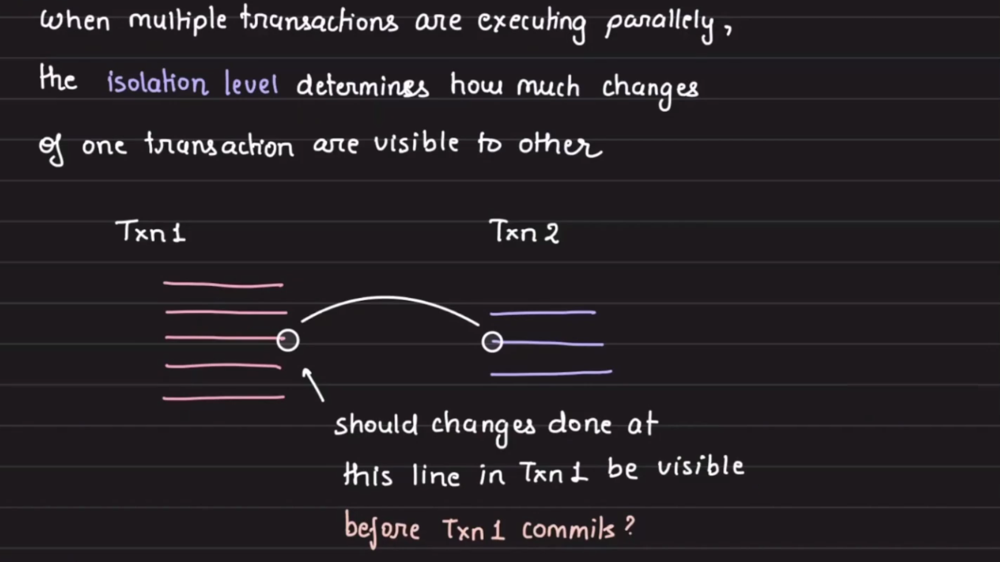

6.  Database Isolation Levels.mp4 [Isolation Levels](Isolation%20levels.md)

    1.  **Read Uncommitted** - The lowest isolation level where transactions can see uncommitted changes made by other transactions.
    2.  **Read Committed** - A transaction can only see changes committed by other transactions. Uncommitted data is not visible.
    3.  **Repeatable Read** - Ensures that if a transaction reads a value, no other transaction can modify or delete that value until the current transaction is complete.
    4.  **Serializable** - The highest isolation level, which ensures complete isolation. Transactions are executed in such a way that they appear to be serially executed, one after another.

7.  Scaling Databases.mp4
    - Horizontal Scalability
    - Vertical Scalability

- 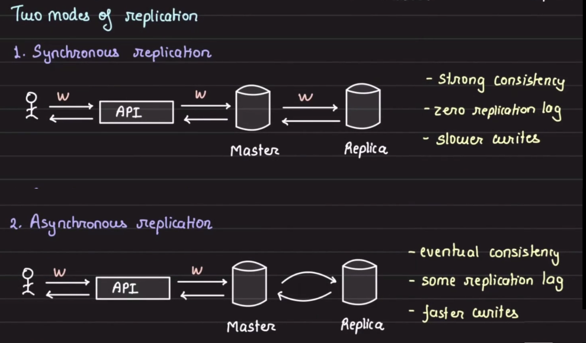

  - **Horizontal Scaling** : Sharding
    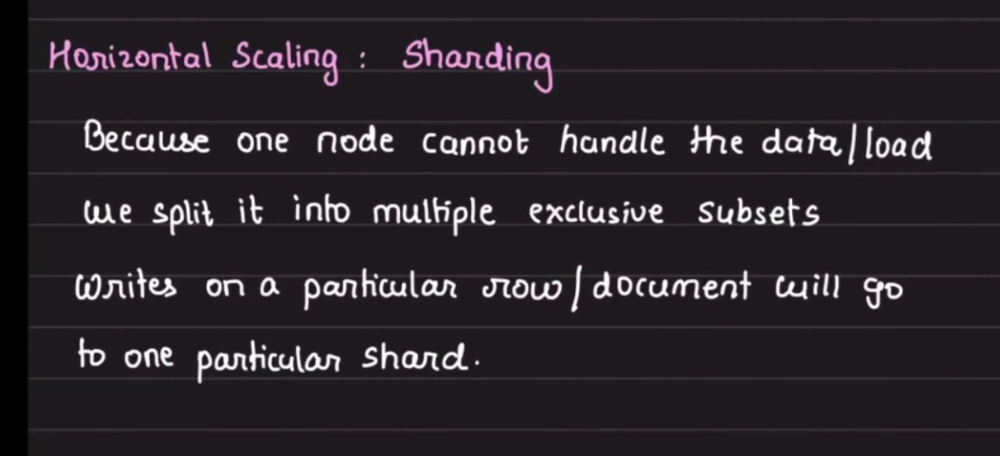
    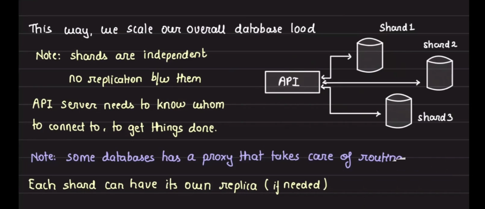
    TODO: Implement Relication and Sharding on postgress

8.  Sharding and Partitioning.mp4
9.  Non-Relational Databases.mp4
10. Picking the right database.mp4
11. What is caching.mp4
12. Populating and scaling a cache.mp4
13. Caching at different levels.mp4
14. Message Brokers and Queues.mp4
15. Message Stream and Kafka Essentials.mp4
16. Realtime Pubsub.mp4
17. Load Balancers.mp4
18. Circuit Balancers.mp4
19. Data Redundancy \_ Recovery.mp4
20. Leader Election for auto-recovery.mp4
21. Client server model \_ Communication protocols.mp4
22. Blob Storage \_ S3.mp4
23. Bloom Filters.mp4
24. Consistent Hashing.mp4
25. Introduction to Big Data Tools.mp4
26. Design Ecommerce Product Listing.mp4
27. Designing API Rate Limiter.mp4
28. Designing \_ Scaling Notifications.mp4
29. Designing Realtime Abuse Master.mp4
30. Designing Tinder Feed.mp4
31. Desigining Twitter Trends.mp4
32. Designing URL Shortner.mp4
33. Designing GitHub Gists and PasteBin.mp4
34. Designing a Fraud Detection system.mp4
35. Designing a Recommendation Engine.mp4
36. Designing a Web Crawler.mp4
    Notes.txt
