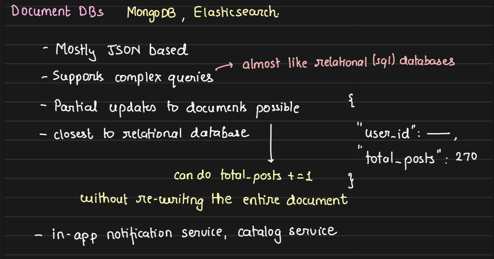
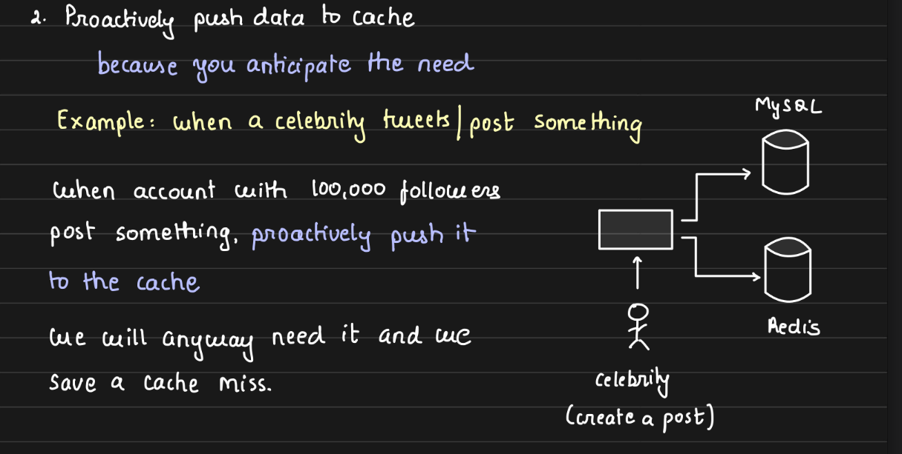

# Arpit Bhayani - The System Design Masterclass 2022-6

# System Design Introduction Basics

1.  Course Introduction.mp4
2.  What is System Design.mp4
    
3.  How to approach system design.mp4

    - Understand the problem statement
    - Break down into componenets
      
    - Dissect each component
      
      

4.  How do you evaluate that you have built a good system.mp4

    - Every system is <mark>infinitely</mark> buildable hence knowing when to stop evolution is important.
    - 1. Break System into components
    - 2. Every system has clear responsibilitities (exclusive scope)
         
    - 3. For each component slight details are figured out.
         
    - 4. Each component ( in isolation ) is :
      - Scalable
      - Fault tolerant
      - Available
        

# DataBases

5.  Relational Databases.mp4
    Key properties of Relational Databases are

    1.  Data consistenty
    2.  Data durability
    3.  Data integrity
    4.  Constraints
    5.  Everthing in one Place

    - ACID
    - 

      - Atomicity - All statements within a transaction take effect or none.
      - Consistency - Data will never go incorrect
      - Isolation -
      - 

6.  Database Isolation Levels.mp4
    [Isolation Levels](06_Isolation%20levels.md)

    1.  **Read Uncommitted** - The lowest isolation level where transactions can see uncommitted changes made by other transactions.
    2.  **Read Committed** - A transaction can only see changes committed by other transactions. Uncommitted data is not visible.
    3.  **Repeatable Read** - Ensures that if a transaction reads a value, no other transaction can modify or delete that value until the current transaction is complete.
    4.  **Serializable** - The highest isolation level, which ensures complete isolation. Transactions are executed in such a way that they appear to be serially executed, one after another.

7.  Scaling Databases.mp4
    - Horizontal Scalability
    - Vertical Scalability

- 

  - **Horizontal Scaling** : Sharding
    
    
    TODO: Implement Relication and Sharding on postgress

8.  Sharding and Partitioning.mp4
    https://drive.google.com/file/d/1JdvmpmDxdRVQ0TcNh3c4FROib0Vl3I08/view
    They have a nuanced Difference

    - **Sharding** : Distributing data across multiple Machines.
      - Its about **database**
    - **Partitioning** : Splitting the data within the same machine.
      - It's about **data**
    - 

    - How is Database Scaled
      - Every database has a limit.
      - TODO :Add corresponding Images from Page 2 ,3 and 4
      - Say my DB processes 1000 rps then load increases to 2000 rps
      - We can shard and plit load to 2 servers
      -
      - https://drive.google.com/file/d/1JdvmpmDxdRVQ0TcNh3c4FROib0Vl3I08/view
    - ## How to Shard 100 GB Data in a Database
    - ### 100 GB Data
      
    - ### 100 Gb Data Sharded
      
    - How to Partition Data
      - Vertical vs Horizontal
        
      - Sharding vs Partitioning
      - 
      - ## Advantages and Disadvanteages of Sharding
        - We cannot run cross shard queries. As they
        - 

9.  Non-Relational Databases.mp4

    https://drive.google.com/file/d/1NTHxb11DDAz8TweZNpki-nv786RVE8NC/view
    TODO : Use cases for Document DB

    ### Document DB

    

    ### Key Value Pair DB

    

    ### Graph DBs

    
    TODO Exercise : Setup No SQL DataBases on your machines and Play around with them

    [09_NoSQL_DBs.md](NoSQL_DBs)

10. Picking the right database.mp4
    - https://drive.google.com/file/d/1e29ezXnZFvrNfUd2MaX7id1DwR1rKXdu/view
    - TODO :Attach Screen shots
    - A new database is created to solve any one problem really well.
    - Why Non Relational DataBases Scale
    - Does this mean No dataBase is different
    - How does this help in designing systems
    - How to pick the right DB.

# Caching

11. What is caching.mp4
    https://drive.google.com/file/d/1OKeAs4tA44toEiJ1dfrtY5fmJHPsDBg3/view

    Cache is a place

    - Cache helps to save disk io, network io or CPU io.
      
    - Caches how are they used
      
      - Popular Caches used in the industry
        - **Memcached**
        - **Redis**
    - Caches are not restricted to RAM based storage
    - storage that is 'nearer'
    - In simplest forms

      - Caches are just glorified **hash tables**.

    - Examples of best use case for caches
      - A user tweets a tweet. Now the tweet is cached for other users to read rather than
      - Google News
      - Access Token
      - Live Streaming
    - 
    - TODO : Exercise
      - Setup Redis locally
      - put and get some data
      - measure time diff
      - compare time diff with a DataBase

12. Populating and scaling a cache.mp4

- https://drive.google.com/file/d/15YNYOGqI4GxXqAeonVWQ6sQlkks8aM7g/view
- 
  1.  Population
      1.  Lazy Population
          - 
      2.  Eager Population
          - Write to bothe Database and cache at the same time
            
          - Proactively push data to Cache
            
  2.  Scaling a Cache
      - Cache is a database hence scaling techniqueues for a cache like Redis are similar to that of a database.
      1. Vertical Scaling
         
      2. Horizontal Scaling
         
         

13. Caching at different levels.mp4

- https://drive.google.com/file/d/1nsDQUdMHyZCb94_ja5GwNjLDqGNGOkdK/view

- **CDN**
  TODO Exercise
  - Create an account at Akomoi/CloudFlare
  - Configure a simple CDN and understand how it is used.
  - Cache a simple image in CDN and access it from CDN using CDN URL

# Pub Sub

14. Message Brokers and Queues.mp4

- https://drive.google.com/file/d/1FoolFZv0zt2q0yY3t8S1vz-Ki3ehOgDK/view
- There are two types communications Synchronous and Asynchronous
- Synchronous
  - Logging in
- Asynchronous

  - Long Running Tasks
  - Trigger Dependent Tasks Across Machines
    - Eg :-
    - Spinning up VM - In the above case the system gives a status update to client
    - Video Encoding Decoding
      

- **Message Queues** are called Message Brokers.
- **Message Brokers**
  a. Help connect different sub-systems
  b. Can connect Different Sub Systems
  c. Can Retain Message for <mark>n</mark> days
  d. Can Re-queue the messages if not deleted. This is to ensure task is completed.

- Typical FLow using a message Queue
- TODO:Exercise
  - Setup Rabbit MQ Locally
  - Write code to push and pull messages
  - Go through documentation

15. Message Stream and Kafka Essentials.mp4

- Differ a little from Message Queues
- Kafka Essentials

  - Kafka Message stays in the stream till it 'expires'.
  - Kafka has topics
  - Every Topic has 'n' Partitions
  - Message is sent to a topic
  - Messages are asigned to paritioned based on Hash Value
  - Within PAritions Messages are paritioned
  - Limitations :
    - Parallesim is limited by no. of partitions
      - One Paritions can be consumed by One comsumer only
      - hence
      - Max no. of Consumers that can consume is equal to number of Partitions

- TODO: Exercise
  - Setup Kafka Locally
  - Create code to push and read messages from Kafka
  - Fiddle with no. of Partitions, no. of Counsumers etc.
  -

16. Realtime Pubsub.mp4

- Here the message is <mark>pushed</mark> to all consumers rather than a normal message queue where consumers have to pull the message
- Limitation is no Buffer
- Eg. Configuration Push to API's Servers
- TODO: Exercise
  - Setup Redis locally
  - go through Documentation
  - test realTime Broadcast
  - test if Message persists (check if new suscriber gets old messages)
  - Connect to redis via 5 terminals
    - 1 publisher
    - 4 subscribers
    - push message via publisher and test message received via a subscribers
    - push 10 messages
    - add a new suscriber and see if it is able to receive older messages

17. Load Balancers.mp4

- Provide abstraction layer for the client
- Abstracts out complexity from teh end user.
- Load Balancer Algorithms
  - Round Robin
    - Uniform Infrastructure
  - Weighted Round Robin
    - Non Uniform Infrastructure
  - Least Connections
    - Assign connection to server with least load.
    - Good for services which have **very high response time variance**.
  - Hash based routing
    - Near random, hence distribution would be uniform across the server.
    - It would **Sticky** wrt parameter selected for hashing.
- **Scaling :** Allows servers to scale up and scale down as per need.
- **Availability :** Automatically can remove non fuctioning Node
- TODO :
  - Go through AWS load balancer documentation.
  - Play around with a load balancer
  - Look at LB configurations

18. Circuit Breakers

- Prevent Cascading Failures
- We make a call to service only if a service is available.
- It is not a database that we can spin up. It has to implemented based on the product.
- How is it implemented ?
- Service makes a call to Circuit Breaker service before actually contacting the service.
- TODO :
  - Implement a simple Circuit Breaker Database.
  - Say we have profile service and post service.
  - Then we can update the status in CB DB and then make decision.
  - What happens when CB server goes sub down.
  - We cache the status.
  - Here we can use redis pub sub to update the config.

19. Data Redundancy Recovery

- APIs servers are stateless
- Databases are stateful
- TODO : Complete Notes

- TODO:Exercise
  - Setup replica of MYSQL DataBase (mine)
  - Setup replication b/w two MYSQL DataBase
  - See how u can backup a mysql databse
  - See how u can restore a mysql databse

20. Leader Election for auto-recovery

- Doing automatic recovery with leader election
- If a server goes down then the **orchestrator** spins new machine behind the load balancer.
- TODO : Exercise
  - Implement Leader Election with threads rather than machines
  -
  - https://www.meta.ai/c/81e8c827-3d28-44bf-b768-d64db17966cf
  - https://www.geeksforgeeks.org/leader-election-in-system-design/
  - Algorithms for Loader Election
    - Bully Algorithm
    - Ring Algorithm
    - Paxos
    - Raft

21. Client server model Communication protocols.mp4

- Two machines can talk as below
  - Client Demands
  - Server Acts
  - Connection happens across the network
    - **TCP**
      - 3 way handhake for setup
      - 2 way handhake for teardown
      - Connection doen not break automatically as this protocol does not terminate connection automatically.
      - It is just a connection protocol
      - Cannot dictate what data can be sent over the network.
      - Communication happens over the common network
      - **HTTP** : Has mutiple Specification
        - 1.1 is heavily used in production
        - Most commonly used one to date
        - Client and Server and connection is terminated after sending the message to client
          - unless <mark>Connection : keep-alive </mark>header is supported
          -
    - **UDP**
    - **WebSocket**
      - Bi-Directional Connection.
      - Shot polling to the server every few seconds (units of time ) and message is rendered
      - Realtime, Low latency
      - Usecases -
        - Realtime Chat,
        - 'Like Hearts' in Insta chat apps.
        - Realtime stock market ticks
- TODO : Exercise
  - Write simple http web server.
    - Use Flask/Djago to expose simple rest api
    - Write simple TODO App - DB - Simple UI
  - **Sockets :** Build Chat application using SocketIO

22. Blob Storage - S3

- https://drive.google.com/file/d/1v6k7x5ebXbsZvPXO5AWIM3jrLxg1Zw3e/view

- **Binary Large Object**
- Worlds most popular storage
- Bucket is the location
- 'path' is the key of the file
- Four features of S3
  - Infinitly scalable network attached storage
  - Create, Replace, Delete Files
  - Read entire files or segments of File
  - Advantages :
    - Cheap, Scalable,
  - Disadvantages :
    - Reads are slower than SSD
    - Not a full fleged file system.
    - Need AWS SDK to talk to S3
- ## TODO : Exercise
  - Go through s3 Documentation
  - Explore their APIs
    - Read, Write and Replace Files
    - Read fragment of files
    - Uploading huge files( muti-part upload and failure handling)
  - Read about ACLs on S3
    - how to make files private to other s3 users
    - how to limit files to be accessed by

23. Bloom Filters.mp4

- Probabilistic Structure
- It is a bit based filter.
- Example -

  - Say i want to recommend videos a user has not watched.
  - Obvious Answer : Create a set of user watched list.
  - But with millions of users this will be a big problem

- 
- As more and more keys are added more and more, 1's increase
- and False positive rate increases.
- So we have to tune the size of the bloom filter as per over needs.
- We cannot extend a bloom filter easiely

  - Create a new Bloom Filter with larger size
  - Ingest all the data again into the bigger bloom filter.

- Redis supports a bloom filter
- To enlarge a bloom filter we need to reingest the data
- **Practical Applications :**

  - user should be okay with some false positive
  - Recomendation engines
  - Web crawlers
  - Feed generation
  - Tinder Feed

- TODO - Exercise

  - Setup Redis Locally
  - Read Redis documentaion on Bloom Filter
  - Write small code to play around with it
  - Try to get one Flase Positive result

24. Consistent Hashing.mp4

    - https://drive.google.com/file/d/1msL9o1-a3ARfiPzY1u38LVbXWR7ptb35/view

- Output of the same key from a hash function is always the same.
- Select a server to connect from load balancer
- It is stateless
  - hashing used for determinng a server to connection.
- Answers problem of who owns what ?
  - Does not do data movement
  -
- ## Distributes Storage - Statefull

- Exercise : TODO

  - implement it in your favourite programing language
  - user 2 arrays and one binary search

#

25. Introduction to Big Data Tools.mp4

- https://drive.google.com/file/d/1QcUq_BatU6MjJwsGw5ZelLm_Gkczi4U6/view
- Exercise : TODO
  Spark
  Spark Streaming

26. Design Ecommerce Product Listing.mp4

27. Designing API Rate Limiter.mp4

- Rate limter is used to protect a system be keeping a track a count of requests
- Use the correct exception code of 429
  - HTTP 429 Too Many Requests client error response status code
- Fixed window algorithm
- DB is updated for each request coming to the system
- Key value pair with expiration
- with Redis

#

28. Designing a Notifications Service.mp4

- Sends a 'message' in bulk to multiple clients
- Should be scalable
- Support a 'fan out' architecture
-

29. Designing Realtime Abuse Master.mp4

    - Abuse dictionaly is a text file and stored in a location say S3
    - Approach 1 :
      - Store abuses in a set - Ineficient approach
    - Approach 2 :
      - Use `Trie` String matching

30. Designing Tinder Feed.mp4
31. Desigining Twitter Trends.mp4
32. Designing URL Shortner.mp4
33. Designing GitHub Gists and PasteBin.mp4
34. Designing a Fraud Detection system.mp4
35. Designing a Recommendation Engine.mp4
36. Designing a Web Crawler.mp4
