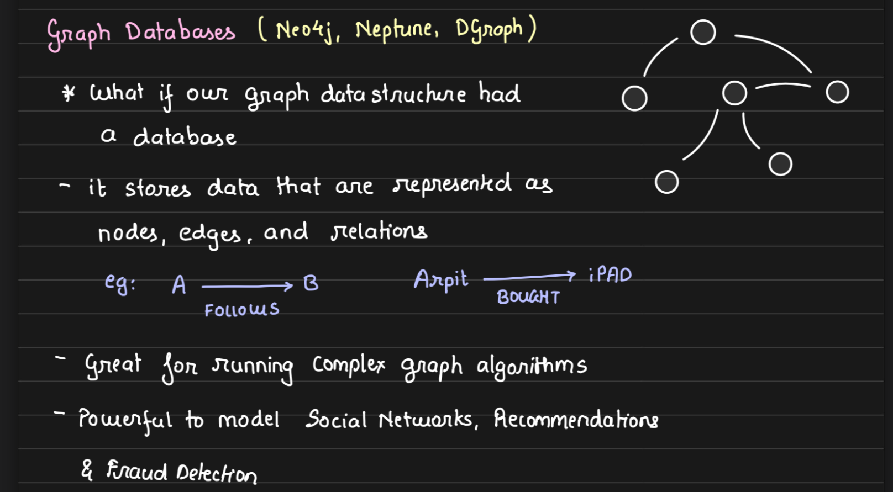

# Arpit Bhayani - The System Design Masterclass 2022-6

# System Design Introduction Basics

1.  Course Introduction.mp4
2.  What is System Design.mp4
    
3.  How to approach system design.mp4

    - Understand the problem statement
    - Break down into componenets
      
    - Dissect each component
      
      

4.  How do you evaluate that you have built a good system.mp4

    - Every system is <mark>infinitely</mark> buildable hence knowing when to stop evolution is important.
    - 1. Break System into components
    - 2. Every system has clear responsibilitities (exclusive scope)
         
    - 3. For each component slight details are figured out.
         
    - 4. Each component ( in isolation ) is :
      - Scalable
      - Fault tolerant
      - Available
        

# DataBases

5.  Relational Databases.mp4
    Key properties of Relational Databases are

    1.  Data consistenty
    2.  Data durability
    3.  Data integrity
    4.  Constraints
    5.  Everthing in one Place

    - ACID
    - 

      - Atomicity - All statements within a transaction take effect or none.
      - Consistency - Data will never go incorrect
      - Isolation -
      - 

6.  Database Isolation Levels.mp4 [Isolation Levels](Isolation%20levels.md)

    1.  **Read Uncommitted** - The lowest isolation level where transactions can see uncommitted changes made by other transactions.
    2.  **Read Committed** - A transaction can only see changes committed by other transactions. Uncommitted data is not visible.
    3.  **Repeatable Read** - Ensures that if a transaction reads a value, no other transaction can modify or delete that value until the current transaction is complete.
    4.  **Serializable** - The highest isolation level, which ensures complete isolation. Transactions are executed in such a way that they appear to be serially executed, one after another.

7.  Scaling Databases.mp4
    - Horizontal Scalability
    - Vertical Scalability

- 

  - **Horizontal Scaling** : Sharding
    
    
    TODO: Implement Relication and Sharding on postgress

8.  Sharding and Partitioning.mp4
    https://drive.google.com/file/d/1JdvmpmDxdRVQ0TcNh3c4FROib0Vl3I08/view
    They have a nuanced Difference

    - **Sharding** : Distributing data across multiple Machines.
      - Its about **database**
    - **Partitioning** : Splitting the data within the same machine.
      - It's about **data**
    - 

    - How is Database Scaled
      - Every database has a limit.
      - TODO :Add corresponding Images from Page 2 ,3 and 4
      - Say my DB processes 1000 rps then load increases to 2000 rps
      - We can shard and plit load to 2 servers
      -
      - https://drive.google.com/file/d/1JdvmpmDxdRVQ0TcNh3c4FROib0Vl3I08/view
    - ## How to Shard 100 GB Data in a Database
    - ### 100 GB Data
      
    - ### 100 Gb Data Sharded
      
    - How to Partition Data
      - Vertical vs Horizontal
        
      - Sharding vs Partitioning
      - 
      - ## Advantages and Disadvanteages of Sharding
        - We cannot run cross shard queries. As they
        - 

9.  Non-Relational Databases.mp4

    https://drive.google.com/file/d/1NTHxb11DDAz8TweZNpki-nv786RVE8NC/view
    TODO : Use cases for Document DB

    ### Document DB

    

    ### Key Value Pair DB

    

    ### Graph DBs

    
    TODO Exercise : Setup No SQL DataBases on your machines and Play around with them

    [NoSQL_DBs.md](NoSQL_DBs)

10. Picking the right database.mp4
    - https://drive.google.com/file/d/1e29ezXnZFvrNfUd2MaX7id1DwR1rKXdu/view
    - TODO :Attach Screen shots
    - A new database is created to solve any one problem really well.
    - Why Non Relational DataBases Scale
    - Does this mean No dataBase is different
    - How does this help in designing systems
    - How to pick the right DB.

# Caching

11. What is caching.mp4
    https://drive.google.com/file/d/1OKeAs4tA44toEiJ1dfrtY5fmJHPsDBg3/view

    Cache is a place

    - Cache helps to save disk io, network io or CPU io.
      
    - Caches how are they used
      
      - Popular Caches used in the industry
        - **Memcached**
        - **Redis**
    - Caches are not restricted to RAM based storage
    - storage that is 'nearer'
    - In simplest forms

      - Caches are just glorified **hash tables**.

    - Examples of best use case for caches
    - 
    - TODO : Exercise
      - Setup Redis locally
      - put and get some data
      - measure time diff
      - compare time diff with a DataBase

12. Populating and scaling a cache.mp4
13. Caching at different levels.mp4

# Pub Sub

14. Message Brokers and Queues.mp4
15. Message Stream and Kafka Essentials.mp4
16. Realtime Pubsub.mp4

# 
17. Load Balancers.mp4
18. Circuit Balancers.mp4
19. Data Redundancy \_ Recovery.mp4
20. Leader Election for auto-recovery.mp4
21. Client server model \_ Communication protocols.mp4
22. Blob Storage \_ S3.mp4
23. Bloom Filters.mp4
24. Consistent Hashing.mp4
25. Introduction to Big Data Tools.mp4
26. Design Ecommerce Product Listing.mp4
27. Designing API Rate Limiter.mp4
28. Designing \_ Scaling Notifications.mp4
29. Designing Realtime Abuse Master.mp4
30. Designing Tinder Feed.mp4
31. Desigining Twitter Trends.mp4
32. Designing URL Shortner.mp4
33. Designing GitHub Gists and PasteBin.mp4
34. Designing a Fraud Detection system.mp4
35. Designing a Recommendation Engine.mp4
36. Designing a Web Crawler.mp4
    Notes.txt
37. ssss
38. https://drive.google.com/file/d/1OKeAs4tA44toEiJ1dfrtY5fmJHPsDBg3/view

39. https://drive.google.com/file/d/15YNYOGqI4GxXqAeonVWQ6sQlkks8aM7g/view

40. https://drive.google.com/file/d/1nsDQUdMHyZCb94_ja5GwNjLDqGNGOkdK/view

41. https://drive.google.com/file/d/1FoolFZv0zt2q0yY3t8S1vz-Ki3ehOgDK/view

42. https://drive.google.com/file/d/1mwactTgMv8mMUGonrrM41mzIvfKsHq02/view

43. https://drive.google.com/file/d/1Bc2tfrpyXA124_jixRngoYULtUZ085s9/view

44. https://drive.google.com/file/d/1QpP07BS0B538TP_EV2BH7qJv6ZftWG9q/view

45. https://drive.google.com/file/d/1goC1zw2eVN3CLfl006srSQi9VSIbwp2L/view

46. https://drive.google.com/file/d/1Z6sEvhWJXJSgyHBaww0xIRtAhZGTczS_/view

47. https://drive.google.com/file/d/1PvGqj4BMB8TyE-rGh17RHCJe8qqpucoB/view

48. https://drive.google.com/file/d/1EnJSlNneQWpFTfdFXSvoSYAcXgakXJJg/view

49. https://drive.google.com/file/d/1v6k7x5ebXbsZvPXO5AWIM3jrLxg1Zw3e/view

50. https://drive.google.com/file/d/1pD5a-q4bTq6ST1sxqiAqLUqbJdCVqHbU/view

51. https://drive.google.com/file/d/1msL9o1-a3ARfiPzY1u38LVbXWR7ptb35/view

52. https://drive.google.com/file/d/1QcUq_BatU6MjJwsGw5ZelLm_Gkczi4U6/view

53. https://drive.google.com/file/d/1wwXoHpI_IYHoVpqQSm8eT2vleZ1-mhaG/view

54. https://drive.google.com/file/d/1smRs4eAYFicvSUaTH1Rg3SrDNCsOEecn/view

55. https://drive.google.com/file/d/1r23gZWNyg85h6GULibmwTWx6UkisOQW0/view

56. https://drive.google.com/file/d/1j8qUbpegfue229w3d8n7JYTufwVKW5cH/view

57. https://drive.google.com/file/d/12tYoAqWFACK1m4_D0_OEnss8ZQbUVq6B/view

58. https://drive.google.com/file/d/12McUAXH9yu1ygJt7HQyj3tOhUnT0_-yg/view

59. https://drive.google.com/file/d/1sb1QGbcklqtCm0UiWdu12hYjjrtBg0jW/view

60. https://drive.google.com/file/d/1tbG4OHi-kPos05NklfXzou-tUd-sat9-/view

61. https://drive.google.com/file/d/1BhlH8O7E_2ZtxlA_BuP1gIZvrBHczngK/view

62. https://drive.google.com/file/d/1E2PZoA5R64npMztxKRuLGzqYk9Ovl53d/view

63. https://drive.google.com/file/d/1iynQJ_1ZYMYS-V3mThtMPFsqarhVI08m/view
