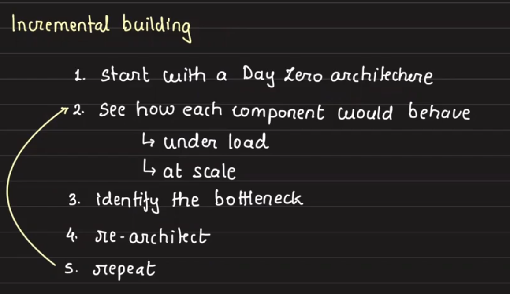

Structure of Solving System Design Problem

- Spiral

  - Core use case specific
  - 

- Incremental

  - 

- Understand the core property & access patterns
- Build an intution towards building systems

- [01 Design Online Offline Indicator](online-offline-indicator.md)
