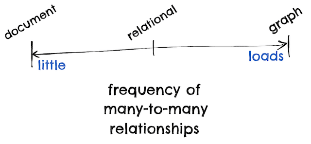
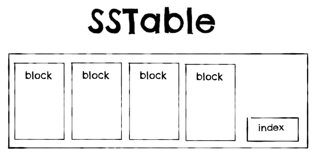

**Book notes: Designing Data-Intensive Applications**

by Martin Kleppmann

{width="6.268055555555556in"
height="4.079166666666667in"}

These are my notes on [[Designing Data-Intensive
Applications]{.underline}](https://amzn.to/2VmRv8P) by [[Martin
Kleppmann]{.underline}](https://twitter.com/martinkl).

A very data intense book.

It made me smile that there is one chapter dedicated to the perils of
distributed programming, when the fact is that the whole book is a
warning after another of all the possible things that can go wrong.

We are doomed.

Martin also explains some of the book contents his [[distributed system
course]{.underline}](https://martin.kleppmann.com/2020/11/18/distributed-systems-and-elliptic-curves.html).

**Key Insights**

- Reliability: Systems should work correctly even in the face of
  adversity, including *human error*.

- Every legacy system is unpleasant on its own way.

- Data models affect how we think about the problem that we are
  solving.\
  
  {width="6.268055555555556in"
  height="2.8993055555555554in"}

- Graph model:

  - Good for evolvability, ease to add new relations and properties.
  - Datalog, declarative query language:

    - Better for complex data.

    - Less convenient for simple one-off queries.

    - [[http://www.learndatalogtoday.org]{.underline}](http://www.learndatalogtoday.org/).

- [[Column oriented storage and bitmap]{.underline}](https://danlebrero.com/2021/09/01/designing-data-intensive-applications-summary/#columnstorage).

- Base64 encoding increases data size by 33%.

- RPC/location transparency: there is no point to make a remote
  service look too much like a local object, because it is a
  fundamentally different thing.

- Two operations are concurrent if neither "happens-before" the other.

- Replication:

  1.  Single-leader replication:

      - Scalability of read-only replicas requires async
        replication.

  2.  Multi-leader replication:

      - Multi datacenter, offline clients, collaborative editing.
      - [[Conflict
        resolution]{.underline}](https://danlebrero.com/2021/09/01/designing-data-intensive-applications-summary/#conflictresolution).

  3.  Leaderless replication:
      - Quorum writes and reads.
      - High availability, low latency, occasional stale read.

- ACID:

  - Consistency is a property of the application, not the database.

- SQL standard definition of isolation levels is flawed.

- In a system with thousands of nodes, something is always broken.

- If you send a request to another node and don't receive a response,
  it is impossible to tell why.

  - When a timeout occurs, you still don't know whether the remote
    node got your request or not, or if is still queued.

- Human error is the major cause of network outages.

- [[Phi Accrual failure
  detector]{.underline}](https://medium.com/@arpitbhayani/phi-%CF%86-accrual-failure-detection-79c21ce53a7a)

- Google assumes 6ms drift for clock synchronized with NTP every 30
  secs, 17 secs if synchronized once a day.

  - Clock reading should return a range of time + confidence level,
    instead of point in time.

- Fencing token:

  - Monotonically increasing id.
  - Server can check if the client still holds a lock/lease by
    remembering the last writer fencing token.

- Linearizability:

  - Make a system appear as if there were only one copy of the data
    and all operations on it are atomic.
  - Due to network delays, quorums do not guarantee linearizability.
  - Linearizability is slow, and this is true all the time.

- [[Consistency and
  consensus]{.underline}](https://danlebrero.com/2021/09/01/designing-data-intensive-applications-summary/#ch-9):

  - Need to reread this chapter 10 more times.
  - Causal consistency is the strongest possible consistency model
    that does not slow down due to network delays, and remains
    available in the face of network failures.
  - Two-Phase Commit (2PC) blocks if coordinator crashes.

    - XA transactions: "Just" a C API for interfacing with the 2PC
      coordinator.

- In practice, making data available quickly - even in a quirky,
  difficult to use format - is more valuable than trying to decide on
  the ideal data model up front.

- Messaging systems:

  - Key design questions:

    1.  What happens if producer is faster than consumer?

    2.  What happens if nodes crash or temporarily go offline? Are
        messages lost?

- [[Turning the DB inside-out]{.underline}](https://www.youtube.com/watch?v=fU9hR3kiOK0).

- Transactions are not enough.

- [TOC](#toc)
- [Foundations of Data Systems](#foundations-of-data-systems)
  - [Chapter 1: Reliable, Scalable, and Maintainable Applications](#chapter-1-reliable-scalable-and-maintainable-applications)
  - [Chapter 2: Data Models and Query Languages](#chapter-2-data-models-and-query-languages)
  - [Chapter 3: Storage and Retrieval](#chapter-3-storage-and-retrieval)
  - [Chapter 4: Encoding and Evolution](#chapter-4-encoding-and-evolution)
- [Distributed Data](#distributed-data)
  - [Chapter 5: Replication](#chapter-5-replication)
  - [Chapter 6: Partitioning](#chapter-6-partitioning)
  - [Chapter 7: Transactions](#chapter-7-transactions)
  - [Chapter 8: The Trouble with Distributed Systems](#chapter-8-the-trouble-with-distributed-systems)
  - [Chapter 9: Consistency and Consensus](#chapter-9-consistency-and-consensus)
- [Derived Data](#derived-data)
  - [Chapter 10: Batch Processing](#chapter-10-batch-processing)
  - [Chapter 11: Stream Processing](#chapter-11-stream-processing)
  - [Chapter 12: The Future of Data Systems](#chapter-12-the-future-of-data-systems)

-->

# Foundations of Data Systems

## Chapter 1: Reliable, Scalable, and Maintainable Applications

- Reliability:

  - Systems should work correctly even in the face of adversity,
    including human error.
  - Fault: component deviating from its spec.
  - Failure: System as a whole stops providing service.

- Scalability:

  - As a system grows (including complexity) there should be
    reasonable ways of dealing with that growth.
  - Latency: duration that a request is waiting to be handled -
    during which is latent.
  - Response time: what the client sees.
  - Head-of-line blocking:

    - Typically, fast request being slow because they are queued
      due to concurrent request being slow and using all
      resources.

    - This is the reason to measure response time from client
      side.

  - Tail latency amplification: in a fan-out service, response time
    is the slowest of the called services, hence high percentiles
    become very important.

- Maintainability:
  - Over time, people should be able to wo# productivel
  - Every legacy system is unpleasant on its own way.
  - Operability, simplicity, evolvability.

## Chapter 2: Data Models and Query Languages

- Data models affect how we think about the problem that we are
  solving.

- Models:

  1.  Relational.

  2.  Document: weak join support (many-to-many), great hierarchical
      (one-to-many).

  3.  Graph.

---

**Document** **Relational**

---

Schema flexibility Better joins

Better performance due to Better many-to-one and many-to-many
locality relationships

Schema on read Schema on write

Updates require rewrite of whole
document

Read always the whole doc

---

- Relational and document databases are becoming more similar:
  - Relational DB support JSON/XML.
  - RethinkDB support joins.

{width="6.268055555555556in"
height="2.8993055555555554in"}

- Graph model:

  - Property graphs (Neo4j).\
     {width="4.858333333333333in"
    height="1.4425360892388452in"}
  - Triple-store (Datomic):

    - RDF: \<subject, predicate, object\>: equivalent to
      vertex--\> prop --\>vertex.

  - Query languages:
  - Declarative:

    - Cypher, SPARQL.

    - Datalog:
      - [[http://www.learndatalogtoday.org]{.underline}](http://www.learndatalogtoday.org/)
      - Rules can be reused and combined.
      - Better for complex data.
      - Less convenient for simple one-off queries.

  - Imperative: Gremlin.
  - Graph processing framework: Pregel.
  - Good for evolvability, eas# to add new relations and propertie
  - SQL recursive common table expressions (WITH RECURSIVE syntax)
    can express graph queries.

## Chapter 3: Storage and Retrieval

- Storage engines: OLTP or OLAP.

- Transactional optimized (OLTP):

  1.  Log structured:

      - Hash indexes:

        - Like HashMaps.
        - All keys must fit in memory.
        - Bitcask storage in Riak. - Write-only file segments, compaction, tombstones like
          Kafka. - Range queries are not efficient. - SSTables (Stored String Table):\
          {width="4.754166666666666in"
          height="2.3423195538057744in"}

        - As Hash indexes but segment files sorted by key.

          - Merging segments simple and efficient.

        - In-memory index sparse:

          - Less memory.

          - Find value by scanning between two other keys.

          - Block read compressed to save IO/disk space.

        - LSM-Tree (Log-Structured Merge-Tree), parts:

          1.  Memtable for current segment (Read-back tree or AVL
              tree).

              - Writen to disk as a SSTable when reaches some
                threshold.

          2.  Periodic compaction (leveled or size-tiered).

          3.  Unordered log for recovery.

          - LevelDB, RocksDB, Cassandra, InfluxDB, HBase,
            ScyllaDB, BigTable, Lucene for the term dictionary.

        - Bloom filters to speed up reading unknown keys.

  2.  Page-oriented (B-Trees):

      - Most common type of index.
      - Key-value pairs sorted by key.
      - Break DB in fixed size blocks (or pages).
        - 4k typically.
      - Branching factor:
        - Depth O(log n) \~= 3-4 levels typically.
      - Update in place of pages.
      - Write-ahead log for resilience.
      - Multiple optimizations.

  3.  Clustered index:

      - Store the indexed row directly within the index.
      - MySQL InnoDB primary key.
      - SQL Server can specify one clustered index per table.

  4.  Covering index:

      - Store some columns with the index.

  5.  Multidimensional index:

      - PostGIS R-trees.

  6.  Lucene, for similar words:

      - [[Levenshtein
        automation]{.underline}](https://en.wikipedia.org/wiki/Levenshtein_automaton).
      - Similar
        to [[trie]{.underline}](https://en.wikipedia.org/wiki/Trie).

  7.  In-memory DBs:
      - Non-durable: Memcached.
      - Durable:
        - Either append-only log or replication or periodic
          snapshot.
        - Relational: VoltDB, MemSQL, Oracle TimesTen.
        - Key-value: RAMCloud.
        - Redis, Couchbase: weak durability due to async writes to
          disk.
      - Faster.
      - May support more data structures (like sets or queues).
      - Anti-caching:
        - To support bigger than memory datasets.
        - Evict to disk based on LRU.
      - Future: [[Non-volatile
        memory]{.underline}](https://en.wikipedia.org/wiki/Non-volatile_memory).

- Analytics optimized (OLAP):

  - Star schema (aka dimensional modeling).

    - Fact tables: events that reference to dimension tables.

    - Dimension tables: the who, what, when, how, why of the
      event.

  - Snowflake schema: when dimensions are broken down in
    subdimensions:

    - More normalized but harder to work with.

  - Very wide tables, over 100 columns typically.

    - Column-oriented storage:

      - Each column file contains the rows in the same order.
      - Less work.
      - Better compression:

        - Bitmap encoding:

          - Good when distinct values is small compared with
            number of rows.

          - If sparse, also run-length encoded.

          - Very efficient bitwise AND/OR for filtering.

            - Vectorized processing.

      - Indices, except for primary, require an entire copy of
        the data.

- LSM-tree vs B-Trees:
  - All the following are "typical" and depend a lot on the
    workload.
  - LSM-trees are faster for write.
  - LSM-trees compress better.
  - B-Trees faster for reads.# - B-Trees have higher write amplificatio
  - LSM-trees compaction process can cause operational issues.

## Chapter 4: Encoding and Evolution

- Base64 encoding increases data size by 33%.

- Avro:

  - More compact than Thrift/Protocol buffers but reader needs the
    writer schema.
  - Friendlier to dynamic generated schemas.
  - Friendlier to dynamic languages.
  - In schema evolution, fields are matched by name (weaker
    connascense than position).

- RPC/location transparency: there is no point to make a remote
  service look too much like a local object, because it is a
  fundamentally different thing.

- RPC/REST: assuming servers are updated before clients:
  - Backward compatible on request.
  - Forward compatible on responses.

# Distributed Data

## Chapter 5: Replication

- Reasons:

  - Increase read throughput. - Increase availability. - Reduce latency.

- Algorithms for replicating changes:

  1.  Single-leader:

      - Writes always go to the leader.
      - Replication:

        - Synchronous.
        - Asynchronous. - Semi-synchronous: 1 follower sync, others async. - [[Chain-replication]{.underline}](https://medium.com/coinmonks/chain-replication-how-to-build-an-effective-kv-storage-part-1-2-b0ce10d5afc3) (Microsoft
          Azure Storage). - Failover issues:
        - In async replication, latest writes maybe lost.

          - Further issues if other storage systems have seen
            the lost write.

            - [[Github outage]{.underline}](https://github.blog/2012-09-14-github-availability-this-week/).

        - Split brain. - What is the right timeout before a leader is declared
          dead?

      - Replication implementations:

        1.  Statement-based:

            - Ship the insert/update/delete statements.
            - Issues:

              - Non-deterministic functions, like rand().

              - Autoincrement columns.
              - Side-effect functions.

        2.  Write-ahead log shipping:

            - Issue: Tightly coupled to storage format.

              - Operational concerns if the storage format
                changes between versions.

            - PostgreSQL, Oracle.

        3.  Local (row-based) log:
            - Specific log format for replication.
            - MySQL binlog.
            - Allow easier change-data-capture.
        4.  Trigger-based replication:

            - Custom logic, flexible.
            - Issues:

              - Bigger overhead. - Bug prone.

      - Scalability of read-only replicas requires async
        replication.
      - Replication lag issues:

        1.  Read-your-own-writes: - Fixes:

            - Read from the leader:
              - For you own data.
              - For some time after a write.
            - Timestamp last write and ensure replica is up to
              date at least up to that timestamp.

        2.  Monotonic reads:

            - When second requests goes to a replica with more replication lag than the first request.
            - Fix: always read from the same replica.

        3.  Consistent prefix reads:
            - In partitioned DBs, event1 happens-before event2,
              but if events are in different partitions, a client
              can see event2 before event1.

  1.  Multi-leader replication:

      - Use cases:

        - Multi datacenter:
          - GoldenGate for Oracle, BDR for PostgreSQL.
          - In general, considered dangerous.
        - Offline clients:
          - CouchDB.
        - Collaborative editing:

          - [[Operational
            Transformation]{.underline}](https://en.wikipedia.org/wiki/Operational_transformation).
          - Google Docs.

      - Conflict resolution: 1. Somewhat fix: All writes to a key always go to the same
        datacenter.

        1.  Convergent conflict resolution:
            - All replicas arrive to the same final result.
            1.  Last write wins (data loss). 2. Higher numbered replica wins (data loss).
            2.  Concatenate values.
            3.  Preserve all values and let the user resolve.
        2.  Custom conflict resolution logic:

            - On write (Burcardo).
            - On read (CouchDB).
            - Usually at the row level , not the transaction level.

        3.  Automatic conflict resolution:
            - CRDTs. Riak.
            - Mergeable persistent data structures.
            - [[Operational
              Transformation]{.underline}](https://en.wikipedia.org/wiki/Operational_transformation).

  1.  Leaderless replication:
      - Dynamo, Riak, Cassandra, Voldemort.
      - Quorum writes and reads.
      - Read repair, anti-entropy process.
      - Strict quorum: write replicas + read replicas \> \#
        replicas.
      - Hard to monitor staleness.
      - High availability, low latency, occasional stale read.
      - Sloppy quorums:
        - Accept writes in nodes that are not the owners of the
          key.
        - Hinted handoff.
      - Issues:
        - Sloppy quorums can return old data.
        - Concurrent writes.
        - Concurrent write and read.
        - Partial write failure in quorum.
        - Node failure can bring writers down.

- Two operations are concurrent if neither "happens-before" the other.
  - Version Vectors:
    - To keep track of "happens-before":
    - Version number of key for each replica.
- Client must send the version vector when writin

## Chapter 6: Partitioning

- AKA:
  - shard in MongoDB, ElasticSearch, SolrCloud.
  - region in HBase.
  - Tablet in BigTable.
  - vnode in Cassandra, Riak.
  - vBucket in Couchbase.
- Skewed partitions and hot spots.
- Partition by:
  - Key range.
  - Hash of key:
    - Range queries not efficient (MongoDB) or not possible (Riak,
      CouchBase, Voldemort).
- Secondary index:
  1.  Partition by Document (aka local index):
      - Query requires scatter/gather all partitions.
        - Tail latency amplification.
      - MongoDB, Riak, Cassandra, ElasticSearch, SolrCloud, VoltDB.
  2.  Partition by Term (aka global index):
      - Writes require talking with multiple partitions.
      - Usually updated asynchronously.
- Rebalancing:
  - Fixed number of partitions:
    - \# partitions way bigger than #nodes.
    - Riak, ElasticSearch, Couchbase, Voldemort.
  - Dynamic partitioning:
    - Split partition when becomes too big, merge when too small.
    - HBase, MongoDB, RethinkDB.
  - Proportional to \# nodes:
    - Fixed \# partitions per node.
    - Cassandra

## Chapter 7: Transactions

- ACID:

  - Atomic: All or nothing.
  - Consistency:

    - Invariants are always true.

    - Property of the application, not the DB.

  - Isolation:

    - Pretend that only one transaction is running at a time.

    - Serializability:
      - Oracle does not implement serializable but snapshot
        isolation.

  - Durability.

- Weak transaction isolation levels:

  1.  Read uncommited:

      - Avoid dirty writes: mixing writes from several transactions.

  2.  Read commited:

      - Avoid dirty reads: read uncommited data.

  3.  Snapshot isolation:
      - Aka serializable in Oracle, repeateable read in MySQL,
        PostgreSQL.
      - Avoids nonrepeable reads (aka. read skew):
        - Reading twice in a transaction and getting different
          results.
        - Transaction can only see values commited before it
          started.
      - Multi-version concurrency control (MVCC).

- SQL standard definition of isolation levels is flawed.

- Write conflicts:

  - Dirty writes.
  - Read-modify-write (aka. lost update):

    1.  Atomic writes:

        - "set value = value + 1".
        - Cursor stability.

    2.  Explicit locking.

    3.  Automatic detection by DB:

        - Snapshot isolation.

    4.  Compare-and-set.

  - Write skew and phantoms:

    - Constraint depends on object A and B, and one transaction
      update A but no B, and the other B but not A.

    - Phantom: a write in one transaction changes the result of a
      search query in another transaction.

    - Fix:

      1.  Serializability.

      2.  Materializing conflicts: create a table with rows to be
          able to lock the rows.

- Serializability:

  - 3 implementation options: 1. Actual serial execution:

        - VoltDB, Redis, Datomic.
        - Through stored procs: send action to data.
        - Single CPU throughput.
        - Scalability through partitioning.

    2.  Two-Phase Locking (2PL):

        - 2PL != 2 phase commit.
        - Readers block writes and writers block readers.
        - Implemented with shared lock + exclusive lock.
        - Predicate locks:

          - Phantoms avoided.

          - Queries are stored as predicates and any row changes
            are matched against them.

          - Index-range locking:

            - Simplify predicate lock to match a greater set:
              less locks, more course grained.

    3.  Serializable Snapshot Isolation (SSI):
        - Optimistic: keep track of read/write rows b#
          transaction and check no concurrency issues on commit.
        - Used also in distributed DB (FoundationDB).

## Chapter 8: The Trouble with Distributed Systems

- Pessimistic and depressing overview of things that may go wrong in
  distributed systems.

- In a system with thousands of nodes, something is always broken.

- If you send a request to another node and don't receive a response,
  it is impossible to tell why.

  - When a timeout occurs, you still don't know whether the remote
    node got your request or not, or if is still queued.

- Human error is the major cause of network outages.

- Delays and queues everywhere.

- [[Phi Accrual failure
  detector]{.underline}](https://medium.com/@arpitbhayani/phi-%CF%86-accrual-failure-detection-79c21ce53a7a)

- Unreliable networks:

  - Telephone networks guarantee a fixed bandwidth for the call,
    hence there is no queueing, and a maximum end-to-end latency.
  - TCP network are designed for bursty traffic.
  - Variable delays are a consequence of dynamic resource
    partitioning.

- Unreliable clocks:

  - Google assumes 6ms drift for clock synchronized with NTP every
    30 secs, 17 secs if synchronized once a day.
  - Time-of-day clock:

    - System.currentTimeMillis().

    - Can go backwards.

  - Monotonic clock:

    - System.nanoTime().

    - Always move forward.

    - Useless across computers.

  - [[Leap seconds and
    smearing]{.underline}](https://www.webopedia.com/definitions/leap-smear/).
  - [[Precision Time
    Protocol]{.underline}](https://en.wikipedia.org/wiki/Precision_Time_Protocol).
  - Clock reading should return a range of time + confidence level,
    instead of point in time.

    - Google TrueTime API is Spanner returns (earliest, latest).

- Process pauses:
  - Example: GC.
  - A node in a distributed system must assume that its execution
    can be paused for a significant length of time at any point,
    even in the middle of a function.
  - Treat GC pauses as outages:
    1.  Notify others that a GC is about to happen.
    2.  Restart process when full GC is required.
- A node in the network cannot know anything for sure.
- Fencing token:

  - Monotonically increasing id.
  - Server can check if the client still holds a lock/lease by remembering the last writer fencing token.

- Byzantine fault: a node is maliciously behaving:
  - Untrusted networks like Bitcoin.

## Chapter 9: Consistency and Consensus

- Linearizability:

  - Aka. atomic consistency, strong consistency, immediate
    consistency or external consistency.
  - Make a system appear as if there were only one copy of the data
    and all operations on it are atomic.
  - Once a new value has been written or *read*, all subsequent
    reads see the value that was written.
  - Two-Phase locking and actual serial execution are typically
    linearizable. SSI is not.
  - Usages:

    - Distributed locks and leader election.

    - Constraints and uniqueness guarantees.

    - Cross-channel timing dependencies:
      - Example: store a image in a DFS and then send a message
        to a queue for the image to be rescaled. No
        linearizability could mean that the rescaling process
        does not find the image.

  - Due to network delays, quorums do not guarantee linearizability.
  - Linearizability is slow, and this is true all the time.

- Ordering helps preserve causality.

- Linearizable systems have total order of operations: there are no
  concurrent operations.

- Causal consistency is the strongest possible consistency model that
  does not slow down due to network delays, and remains available in
  the face of network failures.

- Lamport timestamps:

  - Causal consistency.
  - Tuple (counter, nodeID).
  - Timestamp is sent to/by clients, and server always returns a
    counter + 1.
  - Timestamp ordering is not enough for uniqueness constraints as
    checks is done after the fact.

    - Total order only emerges after collecting all operations.

    - When do you know you have collected all operations?

- Total order broadcast (aka atomic broadcast):

  - Requires:

    - Reliable delivery.

    - Totally ordered delivery.

  - Used by:

    - Consensus: Zookeeper and etcd.

    - DB replication (state machine replication).

    - Serializable transactions.

    - Log.

    - Lock services.

- Linearizable compare-and-set registry and total order broadcast are
  both equivalent to consensus.

- Two-Phase Commit (2PC) blocks if coordinator crashes.

  - If coordinator cannot recover, manual intervention is required.
  - Three Phase commit assumes a network with bounded delays and
    nodes with bounded response times.
  - In MySQL, distributed transactions are ten times slower than
    single node transactions.
  - XA transactions:

    - "Just" a C API for interfacing with the 2PC coordinator.

    - 2PC coordinator usually implemented as a library in the app
      issuing the transaction.

- Fault-tolerant consensus:

  - Leader is unique within an epoch.
  - On leader dead, an election is hold with a higher epoch number.
  - Before leader decides anything, a quorum of nodes approve the
    proposed leader:

    - This way the leader checks that there has not been an
      election, an it is still the leader.

  - Most consensus algorithms assume a fixed number of nodes.
  - Uses:

    - Linearizable compare-and-set registers.

    - Atomic transaction commit.

    - Total order broadcast.

    - Locks and leases.

    - Membership/coordinator service.

    - Uniqueness constraints.

# Derived Data

## Chapter 10: Batch Processing

- The importance of MapReduce is now (2017) declining.

- Map Reduce:

  - Putting the computation near the data.
  - Mappers "send messages" to the reducers, the key being the address.

    - [[Actor
      model!]{.underline}](https://danlebrero.com/2018/04/09/kafka-distributed-coordination-actor-model/#content).

  - Joins:

    - Reduce-side joins:

      - Mappers emit records to join with the same key.
      - Reducer merges the records.
      - Skew/hot keys workaround:

        - [[Pig]{.underline}](https://pig.apache.org/):

          1.  Run sample to find hot keys.

          2.  Send hot keys records to random reducer (usually
              is deterministic).

          3.  Other side of the join must be sent to all
              reducers.

    - Map-side joins:
      - Faster than reduce-side joins but input must oblige some
        conditions.
      - Broadcast hash join:
        - When joining small table with big one: all mappers
          read the small table in memory.
      - Partitioned hash joins:
        - Join input have same number of partitions, with same
          key and same hash function.
        - Mapper has all the data.
      - Map-side merge joins:
        - Same as partitioned hash joins, but also sorted by
          same key.

- In practice, making data available quickly - even in a quirky,
  difficult to use format - is more valuable than trying to decide on
  the ideal data model up front.

- Alternatives to MapReduce:

  1.  Dataflow engines:

      - Spark, Tez, Flink.
      - Explicitly model the flow of data between processing steps.
      - Advantages: - Sorting and other expensive operations only when
        necessary. - Not unnecessary map tasks.
        - More locality optimizations possible as the scheduler
          knows about all steps.
        - Immediate state stored in-memory or local disk.
        - A processing step can start as soon as some input is
          available.
        - Reuse of JVM.
      - Fault tolerance:
        - Snapshotting.
        - Recompute (Spark RDD).

  2.  Pregel processing mode:

      - For graph data.
      - Iterative processing:

        1.  Calculate one step.

        2.  Check completion condition:

            1.  Yes: done.

            2.  No: Go back to "calculate one step".

      - One vertex "sends" a message to other vertex along the edges
        in the graph.
      - Vertex contains state, are fault tolerant and# urabl
      - Fault tolerance:
        - Snapshotting vertex states after iteration.

## Chapter 11: Stream Processing

- Messaging systems:

  - Key design questions:

    1.  What happens if producer is faster than consumer?

        1.  Drop messages.

        2.  Buffer (max size? durable?).

        3.  Backpressure.

    2.  What happens if nodes crash or temporarily go offline? Are
        messages lost?

  - Types:

    1.  Direct messaging from producers to consumers:

        - UDP multicast.
        - ZeroMQ.
        - UDP messaging (StatsD for example).
        - WebHooks.

    2.  Message brokers:

        - JMS/ AMQP.
        - Load balancing + redelivery == messages processed out of
          order.

    3.  Log-based message brokers:
        - Kafka/Kinesis.

- Keeping systems in sync with dual write has 2 issues:

  1.  Race condition if two clients write at the same time, and the
      second writer is faster writing to the seconds system.

  2.  Fault tolerance if second write fails.

- Change-Data-Capture (CDC):

  - Starting point is an initial snapshot + offset of that snapshot.

    - Kafka log compaction make snapshot not required.

  - Some CDC tools integrate the snapshot creation.

- Event sourcing:

  - Easier to evolve apps.
  - Easier to debug.
  - Guard against app bugs.

- Dealing with delayed (straggler) events:

  - Ignore them.
  - Publish a correction.

- Event timestamp for client events, when offline specially:

  1.  Event timestamp using device clock.

  2.  Timestamp when event is sent to server using device clock.

  3.  Timestamp when received by server, according to server clock.

  - \(3\) - (2) is offset between server and client.
  - Apply offset to all events.

- Types of windows:

  1.  Tumbling: fixed length, no overlap.

  2.  Hopping: fixed length, fixed overlap.

  3.  Sliding: fixed length, "continuous" overlap.

  4.  Session: no fixed duration, triggered by inactivity.

- Time dependant joins:

  - Ordering of events is not deterministic across partitions.

- Fault tolerances:

  1.  Micro-batching:

      - 1 second batches, using processing time.
      - Spark Streaming.

  2.  Checkpointing:

      - Triggered by barriers in message streams.
      - Apache Flink.

  3.  Atomic commit:

      - Efficient enough if restricted just to the internal event
        stream.
      - Google Dataflow, VoltDB, Kafka.

  4.  Idempotence:

      - Store message offset in DB.

  5.  Rebuild state:
      - Flink -\> store in HDFS.# - Samza/KafkaStreams -\> store in Kafk
      - Or just rebuild from scratch.

## Chapter 12: The Future of Data Systems

- Author opinions.

- XA has poor fault tolerance and performance characteristics, which
  severely limit its usefulness.

  - Better protocol is possible.

- Unification of batch and streaming to simplify lambda architecture.

- Unix-esque approach of low-level abstractions to the domain of
  distributed OLTP data storage.

- Dataflow across an entire organization looks like one huge DB:

  - Instead of implementing all features in a single integrated DB,
    implement them in different services administered by different teams.

    - Two possible routes:

      1.  Federated DBs:

          - Unify reads.

          - Route of single integrated DB.

          - Example: PostgreSQL foreign data wrapper.

      2.  Unbundled DB:

          - Unify writes.

          - Follow Unix philosophy.

          - [[Turning the DB
            inside-out]{.underline}](https://www.youtube.com/watch?v=fU9hR3kiOK0).

          - Async event log with idempotent writes is more
            robust and practical the distributed transactions
            across heterogeneous systems.

  - Desired: equivalent of mysql \| elasticsearch.
  - [[Differential
    dataflow]{.underline}](https://blog.acolyer.org/2015/06/17/differential-dataflow/).
  - Dataflow == spreadsheet-like.
  - Dataflow to the web browser or mobile app.
  - Desired: fault tolerant abstractions that make it easy to
    provide application-specific end-to-end correctness properties.

    - Transactions are not enough.

  - Desired: more self-validating or self-auditing systems that
    continually check their own integrity, rather than relying on
    blind trust on DBs, HW or app code.

- Event-based systems provide better auditability.

- Maybe certificate transparency or distributed ledgers.

- Ethics!
