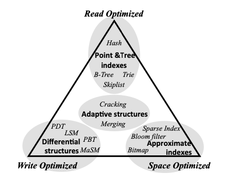

# Absolutely Everything That I Know About Database Indexes

Source : https://www.youtube.com/watch?v=Qhc8gFF2qS8&t=19s
[Database Indexes](Database%20Indexes.jpg)

- 00:00 Intro
- 00:45 Resources & References
- 01:26 Key Concepts
- 01:36 Key Concept: RUM Conjecture

- RUM conjecture ("Database Internals" by Alex Petrov)

  - **Read**
  - **Update**
  - **Memory Overhead**
  - https://blog.asquareb.com/blog/2016/05/10/the-rum-conjecture/
  - -
  - Data access methods need to modified or newly invented to adapt with ever changing workload requirements and hardware changes. This paper looks at the challenges in designing new access methods which increasingly needs to be application and hardware aware. The fundamental challenges faced are to minimize a) Read time - R b) Update cost - U c) memory over head - M and the conjecture made is that when optimizing the read-update-memory (RUM) overheads, optimizing in any two negatively impacts the third. Deciding which overheads to optimize for and to what extend has always been and remains the prominent part of designing access methods.

  - CAP theorem for Indexes
  - Ref : https://www.youtube.com/watch?v=ZxvulmKXIto
  - https://www.codementor.io/@arpitbhayani/the-rum-conjecture-16z2ckqte9

- 03:08 Key Concept: DB = WAL + Materialized View
- 03:50 No Index
- 06:45 Primary Keys
- 08:56 Partitioning Strategies: Hash Partitioning vs. Range Partitioning
- 11:52 K-V Stores
- 14:32 B-Trees vs. LSM-Trees
- 20:33 Secondary Indexes
- 24:15 Local Secondary vs. Global Secondary
- 29:02 Multi-Dimensional Indexes
- 29:37 Concatenated Indexes
- 31:52 R-Trees vs. Quad-Trees vs. Geo-Hashes
- 37:33 Inverted Indexes
- 42:15 Skip Lists
- 44:20 Vector Indexes
- 48:42 Data Cubes & Materialized Views
- 50:56 Count-Min Sketch

---

CONCEPTS

- RUM conjecture
- DB = WAL + materialized view

TYPES of INDICES:

- No index -- kafka / data warehouses

- primary key -- primary key = partition key + sort key

  - partition key = "what node"
  - sort key = whatever's left for satisfying uniqueness constraint

- partitioning strategies

  - consistent hashing / hash partitioning
  - range partitioning
  - random number trick

- KV-store (hash table)

- B-tree
- LSM-tree

- secondary indices
- local secondary indices vs. global secondary indices

- concatenated index

- multi-dimensional indices

  - R-trees
  - quad-trees
  - geo-hash

- inverted index
- skip list
- vector index
- data cubes & materialized views
- count-min sketch

INDEXING

RESOURCES

- DDIA
- Database Internals
- w3schools -- https://www.w3schools.com/sql/sql_create_index.asp

---

CONCEPTS

- DB = WAL + materialized view

TYPES of INDICES

- No index

  - implementations: kafka (which can possibly be thought of as purely a WAL), data warehouses

- primary key -- primary key = partition key + (optional) sort key

  - partition key = "what node"
  - sort key = whatever's left for satisfying uniqueness constraint

- partitioning strategies

  - hash partitioning (aka "consistent hashing")
  - range partitioning
  - random number trick

- KV-store (hash table)

  - hash partitioning makes a lot of sense here
  - can only be done in RAM, that's why you don't see it in PostgreSQL, etc.
  - implementations: memcached, redis

- B-tree -- read-optimized
  - implementations: DynamoDB, PostgreSQL
  - variants: Bw-tree, etc. (check out "Database Internals" by Alex Petrov)
- LSM-tree -- write-optimized

  - implementations: Cassandra, Spanner

- secondary indices -- more read optimization

- local secondary indices
  - this is the "default" / "normal" secondary indices
- global secondary indices

  - probably makes the most sense for read-heavy with key-range queries, and scatter-gather can't be avoided
  - implementations: DynamoDB, possibly Spanner

- multi-dimensional indices

  - concatenated index
  - R-trees
    - implementations: PostgreSQL
  - quad-trees
    - implementations: ElasticSearch
  - geo-hash
    - implementations: redis

- inverted index

  - implementations: ElasticSearch, PostgreSQL, redis
  - example scenarios: text search on a social media site like twitter, google.com, GitHub (recently outgrew ElasticSearch, IIRC)

- skip list

  - implementations: redis (only)
  - example scenarios: gaming leaderboard

- vector index

  - implementations: Pinecone, Facebook's Faiss, PlanetScale's MySQL fork, **redis** (wtf)
  - example scenarios: machine learning problems

- data cubes & materialized views

  - implementations: data warehouses, databases that support OLAP

- count-min sketch
  - in terms of RUM, this is actually very alternative, trading off _accuracy_ for incredible OLAP read latency
  - implementations: Flink, AWS Firehose, Druid, Spark streams, **redis** (wtf) -- "real-time analytics"
