# Caching

- [Caching](#caching)
- [Caching - System Design Concept](#caching---system-design-concept)
  - [How Does Cache Work?](#how-does-cache-work)
  - [Why not store all data in cache?](#why-not-store-all-data-in-cache)
  - [Types of Cache](#types-of-cache)
    - [1. Application Server Cache](#1-application-server-cache)
    - [2. Distributed Cache](#2-distributed-cache)
    - [3. Global Cache](#3-global-cache)
    - [4. CDN (Content Delivery Network)](#4-cdn-content-delivery-network)
  - [Applications of Caching](#applications-of-caching)
  - [Cache Invalidation Strategies](#cache-invalidation-strategies)
  - [Eviction Policies of Caching](#eviction-policies-of-caching)
  - [Pros of Caching](#pros-of-caching)
  - [Cons of Caching](#cons-of-caching)
- [What is cache ?](#what-is-cache-)
  - [Few strategies for cache eviction](#few-strategies-for-cache-eviction)
  - [Cache Patterns/Strategies](#cache-patternsstrategies)
- [Cache Invalidation and the Methods to Invalidate Cache](#cache-invalidation-and-the-methods-to-invalidate-cache)
- [Cache Eviction Policies | System Design](#cache-eviction-policies--system-design)
  - [What are Cache Eviction Policies?](#what-are-cache-eviction-policies)
  - [Cache Eviction Policies](#cache-eviction-policies)
    - [1. Least Recently Used(LRU)](#1-least-recently-usedlru)
    - [2. Least Frequently Used(LFU)](#2-least-frequently-usedlfu)
    - [3. First-In-First-Out(FIFO)](#3-first-in-first-outfifo)
    - [4. Random Replacement](#4-random-replacement)
    - [Conclusion](#conclusion)
  - [Cache Invalidation Methods](#cache-invalidation-methods)
    - [1. Time-based Cache Invalidation](#1-time-based-cache-invalidation)
    - [2. Key-based Cache Invalidation ](#2-key-based-cache-invalidation)
    - [3. Write-through Cache Invalidation ](#3-write-through-cache-invalidation)
    - [4. Write-behind Cache Invalidation ](#4-write-behind-cache-invalidation)
    - [5. Purge Cache Invalidation ](#5-purge-cache-invalidation)
    - [6. Refresh Cache Invalidation ](#6-refresh-cache-invalidation)
    - [7. Ban Cache Invalidation ](#7-ban-cache-invalidation)
    - [8. Time-To-Live(TTL) expiration Cache Invalidation ](#8-time-to-livettl-expiration-cache-invalidation)
    - [9. Stale-while-revalidate Cache Invalidation ](#9-stale-while-revalidate-cache-invalidation)
- [Cache Invalidation vs. Cache Eviction](#cache-invalidation-vs-cache-eviction)
  - [Difference between Cache Invalidation and Cache Eviction](#difference-between-cache-invalidation-and-cache-eviction)
  - [What is Cache Invalidation?](#what-is-cache-invalidation)
  - [What is Cache Eviction?](#what-is-cache-eviction)
  - [Differences between Cache Invalidation and Cache Eviction](#differences-between-cache-invalidation-and-cache-eviction)
  - [Conclusion](#conclusion-1)

# Caching - System Design Concept

Caching is a concept that involves storing frequently accessed data in a location that is easily and quickly accessible. The purpose of caching is to improve the performance and efficiency of a system by reducing the amount of time it takes to access frequently accessed data.

- Caching acts as the local store for the data and retrieving the data from this local or temporary storage is easier and faster than retrieving it from the database.
- In a typical web application, we can add an application server cache and an in-memory store like [Redis](https://www.geeksforgeeks.org/system-design/introduction-to-redis-server/) alongside our application server.

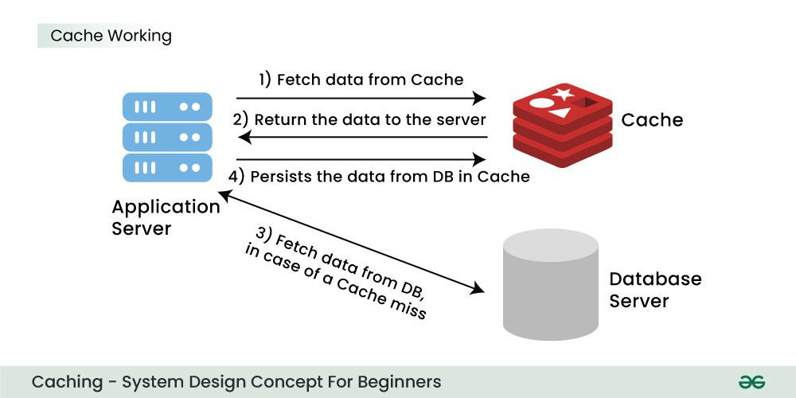

> **Example:** In twitter, when a tweet becomes viral, a huge number of clients request the same tweet, so to reduce the number of calls to the database, we can use cache and the tweets can be provided much faster.

## How Does Cache Work?

Web application stores data in a database. Reading data from the database needs network calls and I/O operations which is a time-consuming process. Cache reduces the network calls to the database and speeds up the performance of the system.

- When the first time a request is made a call will have to be made to the database to process the query. This is known as a cache miss.
- Before giving back the result to the user, the result will be saved in the cache.
- When the second time a user makes the same request, the application will check your cache first to see if the result for that request is cached or not.
- If it is then the result will be returned from the cache. This is known as a cache hit.
- The response time for the second time request will be a lot less than the first time.

## Why not store all data in cache?

As you know there are many benefits of the cache but that doesn't mean we will store all the information in the cache memory for faster access, we can't do this for multiple reasons, such as:

- Hardware of the cache which is much more expensive than a normal database.
- Also, the search time will increase if you store tons of data in your cache.
- Cache is typically a volatile storage, meaning data is lost if the system crashes or restarts. For critical and long-term data, storing it only in cache would risk data loss.
- In short, a cache needs to have the most relevant information according to the request which is going to come in the future.

## Types of Cache

In common there are four types of Cache:

### 1\. Application Server Cache

An Application Server Cache is a storage layer within an application server that temporarily holds frequently accessed data, so it can be quickly retrieved without needing to go back to the main database each time. This helps applications run faster by reducing the load on the database and speeding up response times for users.

> **Example:** When an app frequently needs certain data, the application server can store this data in the cache. When users request it, app can instantly provide the cached version instead of processing a full database query.

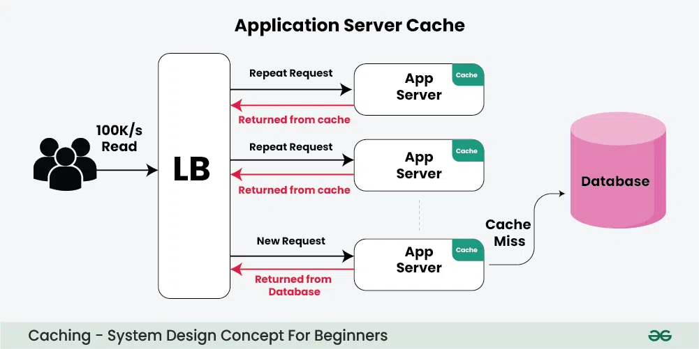

**Drawbacks of Application Server Cache:**

- When you add multiple servers to handle a high volume of requests.
- With several servers, a load balancer sends requests to different nodes, but each node only has its own cache and doesn’t know about the cached data on other nodes.
- This results in many cache misses, meaning the data has to be re-fetched frequently, slowing things down.

> **Note:** To fix this, there are two main options: Distributed Cache and Global Cache.

### 2\. Distributed Cache

In the [distributed cache](https://www.geeksforgeeks.org/system-design/what-is-a-distributed-cache/), each node will have a part of the whole cache space and then using the consistent hashing function each request can be routed to where the cache request could be found.

- Each of its nodes will have a small part of the cached data.
- To identify which node has which request the cache is divided up using a consistent hashing function, so that each request can be routed to where the cached request could be found.
- If a requesting node is looking for a certain piece of data, it can quickly know where to look within the distributed cache to check if the data is available.

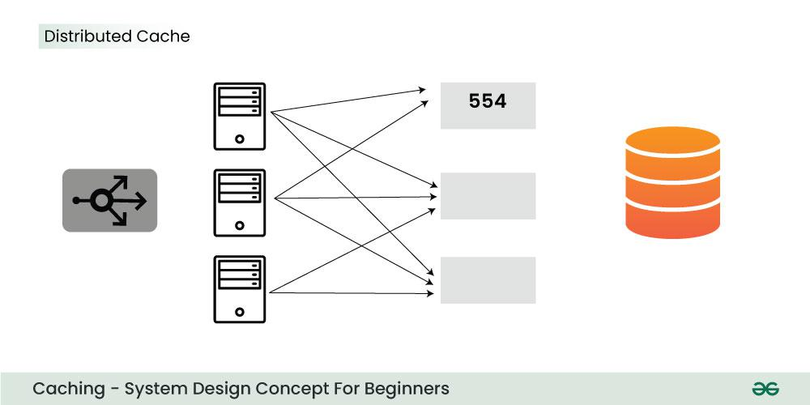

### 3\. Global Cache

As the name suggests, you will have a single cache space and all the nodes use this single space. Every request will go to this single cache space. There are two kinds of the global cache

- First, when a cache request is not found in the global cache, it's the responsibility of the cache to find out the missing piece of data from anywhere underlying the store (database, disk, etc).
- Second, if the request comes and the cache doesn't find the data then the requesting node will directly communicate with the DB or the server to fetch the requested data.

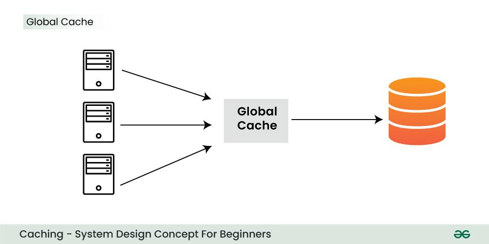

### 4\. CDN (Content Delivery Network)

A [CDN](https://www.geeksforgeeks.org/system-design/designing-content-delivery-network-cdn-system-design/) is essentially a group of servers that are strategically placed across the globe with the purpose of accelerating the delivery of web content. A CDN:

- Manages servers that are geographically distributed over different locations.
- Stores the web content in its servers.
- Attempts to direct each user to a server that is part of the CDN and close to the user so as to deliver content quickly.
- Used where a large amount of static content is served by the website.

> **Note:** It can be an HTML, CSS, JavaScript Files, pictures, videos, etc. First, request ask CDN for data, if it exists then the data will be returned. If not, CDN will query the backend servers and then cache it locally.

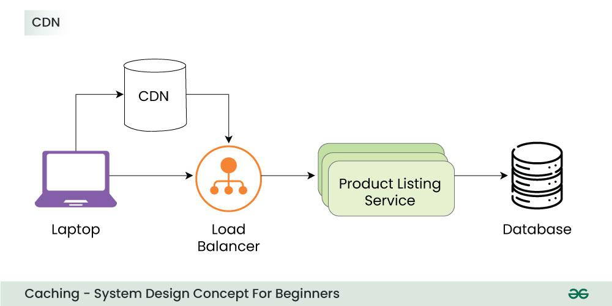

## Applications of Caching

Caching is used in many areas to speed up processes, reduce load and make systems more efficient. Below are some common applications of caching:

- **Web Page Caching**: In order to speed up loading times in the future, browsers save copies of frequently visited websites. This saves bandwidth and shortens the time it takes for a web page to load.
- **Database Caching**: Frequent database queries can strain servers and cause lag. Caching allows apps to quickly retrieve frequently used data without repeatedly asking the database by storing it in memory.
- **Content Delivery Networks (CDNs)**: CDNs use caching to keep copies of data (such as pictures and videos) in several places throughout the globe. This enhances website performance by enabling visitors to obtain content more quickly from a nearby server.
- **Session Caching**: Applications store session data in a cache to remember user information (like login status) between visits, making the experience seamless and personalized without needing to re-login.
- **API Response Caching**: Frequently requested API data, like stock prices or weather data, can be cached so responses are faster, reducing the load on the server and delivering data in real-time.

## Cache Invalidation Strategies

For systems that use caching to improve performance, cache invalidation is essential. Data is temporarily kept for faster access when it is cached. However, the cached version goes out of date if the original data changes.

- In order to guarantee that users obtain the most recent information, [cache invalidation techniques](https://www.geeksforgeeks.org/system-design/cache-invalidation-and-the-methods-to-invalidate-cache/) make sure that out-of-date records are either updated or deleted.
- Common strategies include time-based expiration, where cached data is discarded after a certain time and event-driven invalidation, triggered by changes to the underlying data.
- Proper cache invalidation optimizes performance and avoids serving users with obsolete or inaccurate content from the cache.

## Eviction Policies of Caching

For caching systems to effectively manage their limited cache capacity, eviction policies are essential. An [eviction policy](https://www.geeksforgeeks.org/system-design/cache-eviction-policies-system-design/) decides which existing item to remove when the cache is full and a new item needs to be stored.

- The Least Recently Used (LRU) policy is a popular strategy that eliminates the item that has been accessed the least recently. According to this assumption, items which have been used recently are more likely to be utilized again shortly.
- Another method is the Least Frequently Used (LFU) policy, removing the least frequently accessed items.
- Alternatively, there's the First-In-First-Out (FIFO) policy, evicting the oldest cached item.

## Pros of Caching

As it maximizes resource utilization, reduces server loads and enhances overall scalability, caching is a helpful technique in software development.

- **Improved performance:** By significantly reducing down on the time it takes to get frequently used data, caching can enhance system responsiveness and performance.
- **Reduced load on the original source:** By significantly reducing down on the time it takes to get frequently used data, caching can enhance system responsiveness and performance.
- **Cost savings:** Caching can reduce the need for expensive hardware or infrastructure upgrades by improving the efficiency of existing resources.

## Cons of Caching

Despite its advantages, caching comes with drawbacks also and some of them are:

- **Data inconsistency:** If cache consistency is not maintained properly, caching can introduce issues with data consistency.
- **Cache eviction issues:** If cache eviction policies are not designed properly, caching can result in performance issues or data loss.
- **Additional complexity:** Caching can add additional complexity to a system, which can make it more difficult to design, implement and maintain.

# What is cache ?

In simple words, a hardware or software component that helps in serving the data ,which is either frequently requested or which is computationally expensive to retrieve is called cache . Cache stores such data and helps to render whenever requested. Usually , this data is stored in the form of key -value pair, where key identifies the item uniquely in the cache .

Caching is done in many common scenarios to speed up the process of retrieval , optimize performance and enhance user experience. Most of the systems/applications maintain some sort of cache.

**In Absence of Cache**

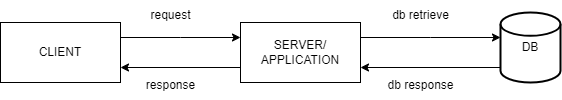

A client(e.g a browser) sends a request to the server for fetching some data ,server in turn fetches the data from backing database/datastore. Now , suppose user again sends same request(for same data), entire flow is repeated — including computation/network heavy database read. So, in order to optimize this process , **we put a cache in between** , **cache is something which is closer to the application/server than the database**. Cache can be part of application/server, in memory store or anything which has lower network cost than it takes to access the database.

**After putting cache in between**

The second or the subsequent requests for the same data doesn’t go to database, but it is fetched from local cache/low latency cache and returned back.

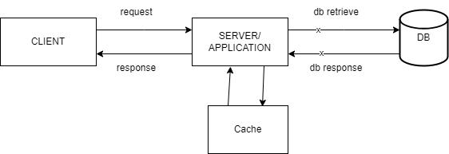

**Cache hit and Cache miss**

If a request is sent to the application and the data is present in the cache, the application reads the data from the cache and returns , it is known as **cache hit**.

However if the data is not present in the cache, the application has to fetch the data from the database. This situation is called as **cache miss**.

The above diagram shows a very basic set up for the caching, we will go into the more advanced patterns in details further in the article.

**Eviction and Invalidation — Volatile nature of cache**

Cache Invalidation — Once a value is loaded into a cache corresponding to some key, its quite possible that after some time , someone/some process would have updated its value in the database, so it needs to be updated or invalidated from the cache too.

How do we invalidate cache ? One way is to keep an expiry time for cache items known as TTL or time to live . How do we determine appropriate ttl ? This is not deterministic , it varies from case to case and to determine an approximate ttl , we should consider the tradeoff between the cache performance and stale data that can be accepted by the system. Cache would not make sense if it needs to be refreshed too frequently.

Cache invalidation can also be done by using application code whenever some data is created or updated in DB, but it again varies from case to case . Hybrid approach for cache eviction is also possible where we use a combination of both approaches.

Cache Eviction — Caching enhances efficiency of read heavy operations but it comes with a cost . We can cache only limited number of keys in cache at one point of time. So, whenever we have a new key that needs to be added to the cache , if it has reached its limit , there must be some other key that should be evicted from the cache.

## Few strategies for cache eviction

**First In First Out** : The key which has come first in the cache leaves the cache first

**Least Recently Used**: The key which has not be used in longest time , leaves cache.

**Least Frequently Used** : The key which has the lowest frequency of usage goes out.

In addition to above mentioned strategies which of course varies from case to case , it is also possible to maintain our own eviction policy(based on some customized algorithm which can combine any of these or implement custom rules to suit the usecase). For example there could be caching eviction policy which only keeps the most frequently used ,that too in recent past — similar to any viral post or any hot products on sale.

## Cache Patterns/Strategies

These are the some generic strategies in which the cache are used in real world application:

1\. **Cache Aside Pattern** : This is the cache placement pattern when cache does not interact with database directly.

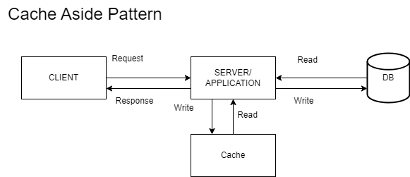

This pattern supports heavy reads. The application works even if the cache goes down for some reason(it fetches directly from DB though).However to maintain a synchronization between the DB values and cache values , some mechanism like ttl/application logic has to be in place.

2\. **Cache Read Through Pattern and Cache Write Through Pattern** : Usually these two patterns are used together in the systems. In these patterns , the cache is placed in between the application and the database.

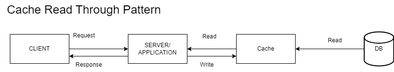

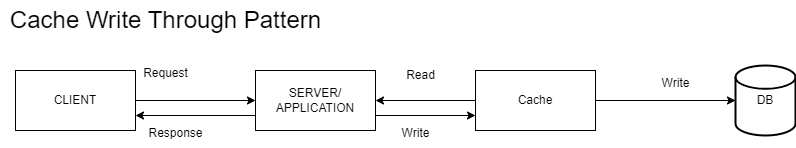

These pattern together can be great option for read heavy workloads , ex- reels, newsfee, etc.However , one thing that needs to be kept in mind here that data model for both cache and databse should be similar. Usually third party libraries/systems are used as cache in such scenarios. Another disadvantage here is failure of caching layer can bring entire system down .Also , it adds some latency while writing to the DB as there is cache in between. So, in order to overcome this issue there is a similar pattern with some deviation that we will go through in the next section.

3\. **Cache Write Around Pattern** — In this pattern , all the set up remains same as above , only the write is done directly to the database. It helps minimizing the write latency as mentioned in the above case.

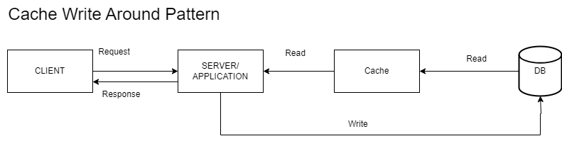

4\. **Cache Write Back Pattern** — This pattern is suitable for write heavy patterns , where a quick response is needed at client side. So, all the writes are written quickly in the cache and response is rendered back to the client. Later , all these write data are batched and written back to the database. This pattern is write efficient approach, but again failure of cache leads to loss of all the write data.

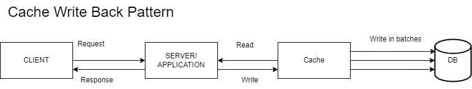

**Which Caching Pattern is the best one?**

The answer to this question is none. The applicability of these patterns varies from case to case. We should also give some thought around — Which is more important ?cache sufficing in case if DB is down or system failure in case if cache is down, can the system have similar models for database or cache or different models for these modules? These are just few points, there are many more that should be discussed while choosing and designing cache for the application.

# Cache Invalidation and the Methods to Invalidate Cache

Cache invalidation is a state where we push away the data from the cache memory. When the data present in cache is outdated. We perform this operation of pushing back or flushing the data from the cache. Otherwise, it will cause data inconsistency.

When cached data gets stale or inaccurate, cache invalidation is the process of removing or updating it. When the original data changes, the process of invalidating a cache involves deleting or updating cached data. It's crucial because programs that rely on cached data may experience issues if it becomes outdated or erroneous over time.

- **Why Cache Invalidation is Important?**

By keeping a copy of frequently accessed material in memory or on a disc, the concept of caching allows users to retrieve that data more quickly. However, the cached copy could grow outdated or erroneous if the original data changes. Incorrect results or performance issues may ensue if the application keeps using the cached data. When the original data changes, the process of invalidating a cache involves deleting or updating cached data.

# Cache Eviction Policies | System Design

The process of clearing data from a cache to create space for fresh or more relevant information is known as cache eviction. It enhances system speed by caching and storing frequently accessed data for faster retrieval. Caches have a limited capacity, though, and the system must choose which data to delete when the cache is full. The cache eviction policies provide the criteria for choosing which data to replace.

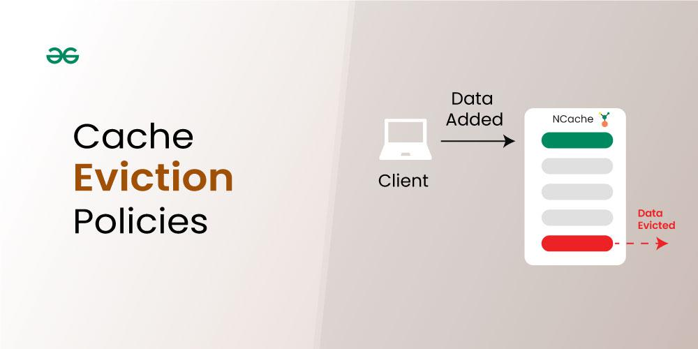
Table of Content

## What are Cache Eviction Policies?

Algorithms or techniques known as cache eviction policies decide which data should be deleted from a cache when its capacity is reached. By keeping the most relevant and often requested data in the cache, these strategies seek to optimize its effectiveness. In systems with limited cache space, effective cache eviction procedures are essential for preserving peak performance while guaranteeing that important data is kept for easy access.

## Cache Eviction Policies

Some of the most important and common cache eviction strategies are:

### 1. Least Recently Used(LRU)

When the cache hits its capacity limit, the Least Recently Used (LRU) cache eviction policy is designed to eliminate the item that has been accessed the least recently. Items that have not been accessed for a longer period of time are assumed to be less likely to be used in the near future. When the cache is full, LRU evicts the item that hasn't been accessed in the longest time since it keeps track of the order in which items are accessed.

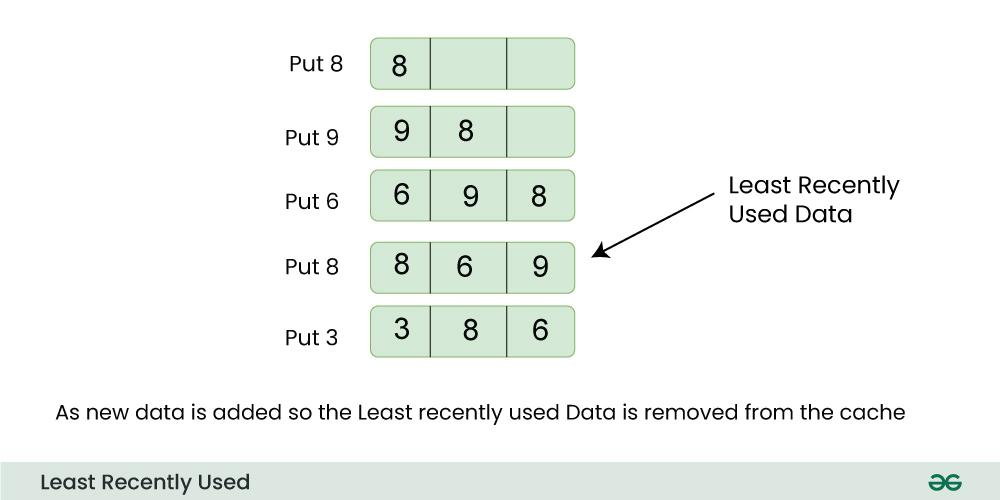

**For Example:**

> Let us consider a cache with a maximum capacity of 3, initially containing items A, B, and C in that order.

- If a new item, D, is accessed, the cache becomes full, and the LRU policy would evict the least recently used item, which is A. The cache now holds items B, C, and D.
- If item B is accessed next, the order becomes C, D, B.
- If another item, E, is accessed, the cache is full again, and the LRU policy would evict C, resulting in the cache holding items D, B, and E. The order now is B, E, D.

LRU ensures that the most recently accessed items are retained in the cache, optimizing for scenarios where recent access patterns are indicative of future accesses.

- **Advantages of Least Recently Used(LRU)**

  - **Easy Implementation:** LRU is a simple option for many caching applications due to its ease of understanding and implementation.
  - **Efficient Use of Cache:** When current accesses are a reliable indicator of future accesses, LRU works well. It guarantees that items that are accessed frequently are more likely to remain in the cache.
  - **Adaptability:** LRU is adaptable to various types of applications, including databases, web caching, and file systems.

- **Disadvantages of Least Recently Used(LRU)**

  - **Strict Ordering:** LRU assumes that the order of access accurately reflects the future usefulness of an item. In certain cases, this assumption may not hold true, leading to suboptimal cache decisions.
  - **Cold Start Issues:** When a cache is initially populated, LRU might not perform optimally as it requires sufficient historical data to make informed eviction decisions.
  - **Memory Overhead:** Implementing LRU often requires additional memory to store timestamps or maintain access order, which can impact the overall memory consumption of the system.

- **Use Cases of Least Recently Used(LRU)**

  - **Web Caching:**
    - LRU is commonly employed to store frequently accessed web pages, images, or resources. This helps in reducing latency by keeping the most recently used content readily available, improving overall website performance.
  - **Database Management:**
    - LRU is often used in database systems to cache query results or frequently accessed data pages. This accelerates query response times by keeping recently used data in memory, reducing the need to fetch data from slower disk storage.
  - **File Systems:**
    - File systems can benefit from LRU when caching file metadata or directory information. Frequently accessed files and directories are kept in the cache, improving file access speed and reducing the load on the underlying storage.

### 2. Least Frequently Used(LFU)

The least frequently accessed entries are eliminated first under the LFU cache eviction policy. It is based on the idea that things that are used the least are less likely to be needed later. When the cache is full, LFU removes the item with the lowest access frequency after keeping track of the amount of times each item is accessed.

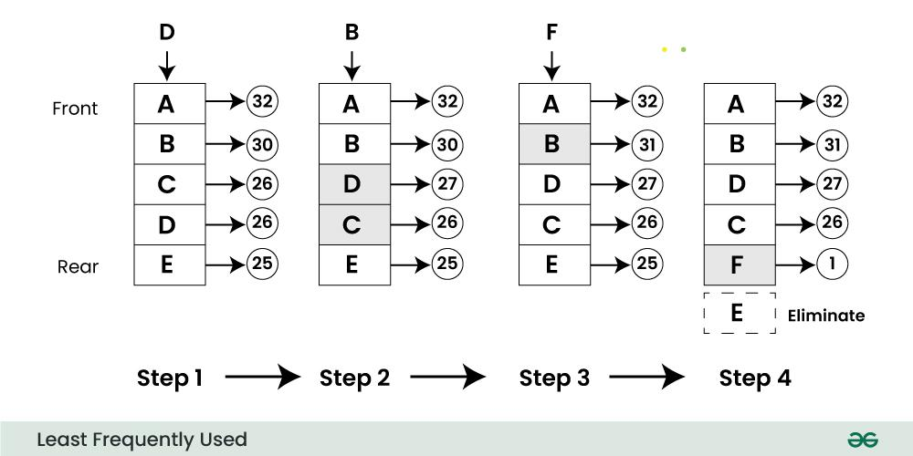

**For Example:**

> Consider a cache with items X, Y, and Z. If item Z has been accessed fewer times than items X and Y, the LFU policy will retain the items X and Y and potentially evict item Z when the cache reaches its capacity.

- **Advantages of Least Frequently Used(LFU)**

  - **Adaptability to Varied Access Patterns:** LFU is effective in scenarios where some items may be accessed infrequently but are still essential. It adapts well to varying access patterns.
  - **Optimized for Long-Term Trends:** LFU can be beneficial when the relevance of an item is better captured by its overall frequency of access over time rather than recent accesses.
  - **Low Memory Overhead:** Since LFU doesn't need to keep timestamps, it might have less memory overhead than some LRU implementations.

- **Disadvantages of Least Frequently Used(LFU)**

  - **Sensitivity to Initial Access:**
  - LFU may not perform optimally during the initial stages when access frequencies are still being established. It relies on historical access patterns, and a new or less frequently accessed item might not be retained in the cache until its long-term frequency is established.
    - **Difficulty in Handling Changing Access Patterns:**
  - LFU can struggle in scenarios where access patterns change frequently. Items that were once heavily accessed but are no longer relevant might continue to be retained in the cache.
    - **Complexity of Frequency Counters:**
  - Implementing accurate frequency counting for items can add complexity to LFU implementations.

- **Use Cases of Least Frequently Used(LFU)**

  - **Database Query Caching:** In database management systems, LFU can be applied to cache query results or frequently accessed data.
  - **Network Routing Tables:** LFU is useful in caching routing information for networking applications. Items representing less frequently used routes are kept in the cache, allowing for efficient routing decisions based on historical usage.
  - **Content Recommendations:** In content recommendation systems, LFU can be employed to cache information about user preferences or content suggestions. It ensures that even less frequently accessed recommendations are considered over time.

### 3. First-In-First-Out(FIFO)

First-In-First-Out (FIFO) is a cache eviction policy that removes the oldest item from the cache when it becomes full. In this strategy, data is stored in the cache in the order it arrives, and the item that has been present in the cache for the longest time is the first to be evicted when the cache reaches its capacity.

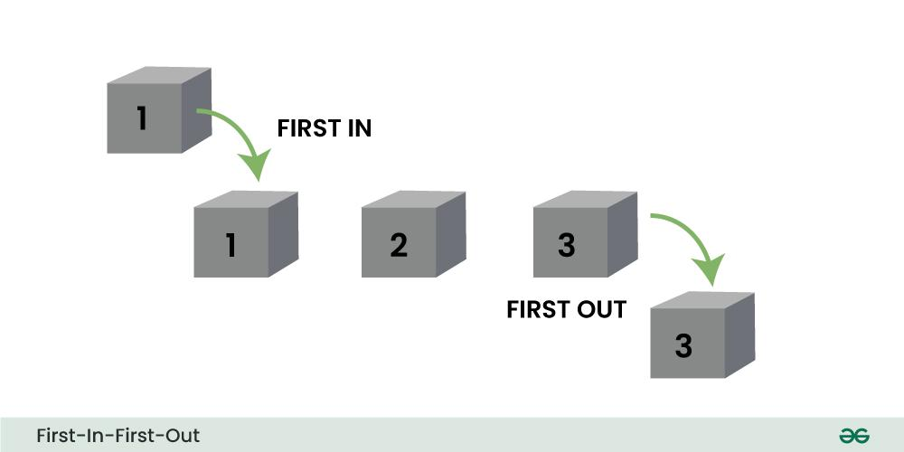

**For Example:**

> Imagine a cache with a capacity of three items:
>
> 1.  A is added to the cache.
> 2.  B is added to the cache.
> 3.  C is added to the cache.
>
> At this point, the cache is full (capacity = 3)

If a new item, D, needs to be added, the FIFO policy would dictate that the oldest item, A, should be evicted. The cache would then look like:

- D is added to the cache (A is evicted).
- The order of items in the cache now is B, C, and D, reflecting the chronological order of their arrival.

* **Advantages of First-In-First-Out(FIFO)**

  - **Simple Implementation:** FIFO is straightforward to implement, making it an easy choice for scenarios where simplicity is a priority.
  - **Predictable Behavior:** The eviction process in FIFO is predictable and follows a strict order based on the time of entry into the cache.
  - **Memory Efficiency:** Since FIFO eliminates the need for extra tracking of timestamps and access frequency, it has a comparatively minimal memory overhead when compared to some other eviction strategies.

* **Disadvantages of First-In-First-Out(FIFO)**

  - **Lack of Adaptability:** FIFO may not adapt well to varying access patterns. It strictly adheres to the order of entry, which might not reflect the actual importance or relevance of items.
  - **Inefficiency in Handling Variable Importance:** FIFO might lead to inefficiencies when newer items are more relevant or frequently accessed than older ones.
  - **Cold Start Issues:** When a cache is initially populated or after a cache flush, FIFO may not perform optimally, as it tends to keep items in the cache based solely on their entry time, without considering their actual usage.

* **Use Cases of First-In-First-Out(FIFO)**

  - **Task Scheduling in Operating Systems:** In task scheduling, FIFO can be employed to determine the order in which processes or tasks are executed.
  - **Message Queues:** FIFO guarantees that messages are handled in the order that they are received in message queuing systems. In applications that depend on message-based communication, this is essential for preserving the order of processes.
  - **Cache for Streaming Applications:** For some streaming applications where preserving the data's order is crucial, FIFO may be appropriate. For instance, FIFO guarantees that frames are displayed in the proper order in a video streaming cache.

### 4. Random Replacement

Random Replacement is a cache eviction policy where, when the cache is full and a new item needs to be stored, a randomly chosen existing item is evicted to make room. Unlike some deterministic policies like LRU (Least Recently Used) or FIFO (First-In-First-Out), which have specific criteria for selecting items to be evicted, Random Replacement simply selects an item at random.

**For Example:**

> Consider a cache with three slots and the following data:
>
> 1.  Item A
> 2.  Item B
> 3.  Item C

Now, if the cache is full and a new item, Item D, needs to be stored, Random Replacement might choose to evict Item B, resulting in:

1.  Item A
2.  Item D
3.  Item C

The selection of Item B for eviction is entirely random in this policy, making it a straightforward but less predictable strategy compared to others.

- **Advantages of Random Replacement**

  - **Simplicity:** Random replacement is a straightforward and easy-to-implement strategy. It does not require complex tracking or analysis of access patterns.
  - **Avoids Biases:** Since random replacement doesn't rely on historical usage patterns, it avoids potential biases that may arise in more deterministic policies.
  - **Low Overhead:** The algorithm involves minimal computational overhead, making it efficient in terms of processing requirements.

- **Disadvantages of Random Replacement**

  - **Suboptimal Performance:** Random replacement may lead to suboptimal cache performance compared to more sophisticated policies. It doesn't consider the actual usage patterns or the likelihood of future accesses.
  - **No Adaptability:** It lacks adaptability to changing access patterns. Other eviction policies, like LRU or LFU, consider the historical behavior of items and adapt to evolving patterns, potentially providing better cache performance over time.
  - **Possibility of Poor Hit Rates:** The random nature of eviction may result in poor hit rates, where frequently accessed items are unintentionally evicted, leading to more cache misses.

- **Use Cases of Random Replacement**

1.  **Non-Critical Caching Environments:**
    - In scenarios where the impact of cache misses is minimal or where caching is employed for non-critical purposes, such as temporary storage of non-essential data, random replacement can be sufficient.
2.  **Simulation and Testing:**
    - In testing situations and simulation environments where simplicity and convenience of use are more important than complex eviction policies, random replacement is helpful.
3.  **Resource-Constrained Systems:**
    - In resource-constrained environments, where computational resources are limited, the low overhead of random replacement may be advantageous.

### Conclusion

In conclusion, cache eviction policies play a crucial role in system design, impacting the efficiency and performance of caching mechanisms. The choice of an eviction policy depends on the specific characteristics and requirements of the system. While simpler policies like Random Replacement offer ease of implementation and low overhead, more sophisticated strategies such as Least Recently Used (LRU) or Least Frequently Used (LFU) take into account historical access patterns, leading to better adaptation to changing workloads.

## Cache Invalidation Methods

Cache invalidation is an important process for maintaining accurate and up-to-date data in a cache. There are several methods of cache invalidation, each with its own advantages and disadvantages. Here are a few of the most popular techniques:

### 1. Time-based Cache Invalidation

Time-based invalidation involves setting an expiration time for cached data.  The cached data must be refreshed from the source once the expiration time has passed because it is then deemed invalid. This approach is straightforward to use and useful for data that doesn't change frequently. However, if the expiration time is set too long or too short, it might result in the use of stale data or unneeded refreshes.

- **Benefits of Time-based Cache Invalidation**

  - Simple to implement.
  - Effective for data that doesn't change frequently.

- **Challenges of Time-based Cache Invalidation**

  - This may lead to the use of stale data if the expiration time is set too long.
  - Unnecessary refreshes if the expiration time is set too short.

### 2. Key-based Cache Invalidation 

Key-based invalidation involves associating a unique key with each piece of cached data. The associated key is invalidated when the original data is altered, and the cached data is either deleted or updated. This approach can guarantee that the most recent data is always used and is effective for data that changes frequently. It might be trickier to put into practice than time-based invalidation, though, and more key storage space might be needed.

- **Benefits of Key-based Cache Invalidation**

  - Effective for data that changes frequently.
  - Ensures that the most up-to-date data is always used.

- **Challenges of Key-based Cache Invalidation**

  - More complex to implement than time-based invalidation.
  - May require additional storage for the keys.

### 3. Write-through Cache Invalidation 

Write-through invalidation involves updating the original data source first and then updating or removing the cached data. By using this technique, the risk of stale data is decreased and the cached data is always current. The application must wait for the primary data source to be updated before updating the cache, so it can be slower than other approaches.

- **Benefits of Write-through Cache Invalidation**

  - Ensures that the cached data is always up-to-date.
  - Reduces the risk of stale data.

- **Challenges of Write-through Cache Invalidation**

  - Slower than other methods because the application must wait for the original data source to be updated before updating the cache.

### 4. Write-behind Cache Invalidation 

Write-behind invalidation involves updating the cached data first and then updating the original data source. Due to the lack of a wait time for the application, while the original data source is updated, this approach may be quicker than write-through invalidation. Because the cached data might not always be in sync with the original data source, it can, however, increase the risk of stale data.

- **Benefts of Write-behind Cache Invalidation**

  - Can be faster than write-through invalidation.

- **Challenges of Write-behind Cache Invalidation**

  - Increases the risk of stale data because the cached data may not always be in sync with the original data source.

### 5. Purge Cache Invalidation 

By using the purge method, cached content for a particular object, URL, or collection of URLs is deleted. When the content has been updated or changed and the cached version is no longer accurate, it is typically used. The cached content is immediately deleted in response to a purge request, and the following request for the content will be fulfilled by the origin server directly.

- **Benefits of Purge Cache Invalidation**

  - Ensures that all cached data is removed and the cache is completely cleared.

- **Challenges of Purge Cache Invalidation**

  - Can be a slow and resource-intensive process
  - Can cause temporary service disruptions if done incorrectly.

### 6. Refresh Cache Invalidation 

Even if there is cached content available, fetches the requested content from the origin server. The cached content is updated with the most recent version from the origin server in response to a refresh request, making sure the content is current. A refresh request, in contrast to a purge, updates the existing cached content with the most recent version rather than erasing it.

- **Benefits of Refresh Cache Invalidation**

  - Can be done quickly and easily
  - Ensures that the cached data is up-to-date

- **Challenges of Refresh Cache Invalidation**

  - This can result in a temporary spike in traffic as clients request the updated resource

### 7. Ban Cache Invalidation 

A URL pattern or header is an example of specific criteria that the ban method uses to invalidate cached content. Any cached content that meets the requirements of a ban request is immediately removed, and any ensuing requests for the content will be fulfilled directly by the origin server.

- **Benefits of Ban Cache Invalidation**

  - Allows you to selectively invalidate cached data without removing all cached data.

- **Challenges of Ban Cache Invalidation**

  - Can be complex to implement and can result in additional overhead.

### 8. Time-To-Live(TTL) expiration Cache Invalidation 

With this technique, cached content is given a time limit after which it becomes stale and needs to be refreshed. The cache checks the time-to-live value when a request for the content is made and only serves the cached content if the value is still valid. The cache gets the most recent copy of the content from the origin server and caches it if the value has expired.

- **Benefits of Time-To-Live(TTL) expiration Cache Invalidation **

  - Allows you to automatically invalidate cached data after a certain amount of time

- **Challenges of Time-To-Live(TTL) expiration Cache Invalidation **

  - This can result in clients receiving stale data if the expiration time is too long.

### 9. Stale-while-revalidate Cache Invalidation 

Web browsers and CDNs employ this technique to serve out-of-date content while it is being updated in the background. When someone requests a piece of content, the cached copy is delivered right away, and an asynchronous request is sent to the origin server to get the most recent copy. The cached version is updated when the most recent version becomes available. The user is always quickly served content thanks to this technique, even if the cached version is slightly out of date.

- **Benefits of Stale-while-revalidate Cache Invalidation**

  - Ensures that clients always have access to some version of the resource, even if it is not the latest version.

- **Challenges of Stale-while-revalidate Cache Invalidation**

  - This can result in clients receiving outdated data for a short period of time.

# Cache Invalidation vs. Cache Eviction

## Difference between Cache Invalidation and Cache Eviction

Cache Invalidation is the process of removing or marking cache entries as outdated when the main database is updated, making sure users always receive fresh data.
Cache Eviction, on the other hand, removes older or less frequently accessed data from the cache to free up space for new data, typically based on certain eviction policies like LRU (Least Recently Used).

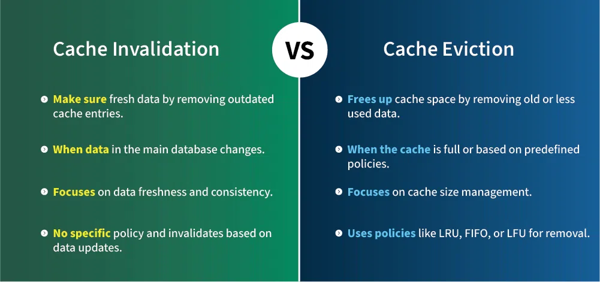

## What is Cache Invalidation?

Cache invalidation is the process of marking or removing stale data in the cache when the data in the main database is updated. It make sure that the cache holds the most up to date information by removing old data.

- **Advantages:**
  - Make sure fresh and accurate data in the cache.
  - It helps in maintaining consistency between cache and database.
  - It reduces the risk of serving stale data to users.
- **Disadvantages:**
  - It can add complexity to manage invalidation rules.
  - May cause slight delays when frequently updating data.
  - It requires careful handling in [distributed systems](https://www.geeksforgeeks.org/computer-networks/what-is-a-distributed-system/) to avoid conflicts.

## What is Cache Eviction?

Cache eviction is the process of removing old or less frequently used data from the cache to free up space for new data. It is based on eviction policies like Least Recently Used (LRU) or First In, First Out (FIFO).

- **Advantages:**
  - It helps in efficiently managing cache size.
  - Improves memory usage by automatically removing old data.
  - Keeps the cache optimized for storing frequently accessed data.
- **Disadvantages:**
  - It can remove important data if the eviction policy is not appropriate.
  - May lead to performance issues if frequently accessed data is evicted.
  - Fetching again deleted data from the main database can cause delays.

## Differences between Cache Invalidation and Cache Eviction

Below are the differences between cache invalidation and cache eviction:

| Aspect                | Cache Invalidation                                               | Cache Eviction                                                           |
| --------------------- | ---------------------------------------------------------------- | ------------------------------------------------------------------------ |
| Purpose               | Make sure fresh data by removing outdated cache entries.         | Frees up cache space by removing old or less used data.                  |
| When Triggered        | When data in the main database changes.                          | When the cache is full or based on predefined policies.                  |
| Focus                 | Focuses on data freshness and consistency.                       | Focuses on cache size management.                                        |
| Policies Used         | No specific policy and invalidates based on data updates.        | Uses policies like LRU, FIFO, or LFU for removal.                        |
| Type of Data Removed  | Removes outdated or stale data.                                  | Removes less frequently used or old data.                                |
| Complexity            | More complex to implement due to data consistency rules.         | Simpler to implement, but choosing the right policy can be tricky.       |
| Impact on Performance | May increase latency when fetching fresh data from the database. | Improves cache performance by keeping frequently accessed data.          |
| Risk                  | Risk of serving outdated data if not done correctly.             | Risk of evicting frequently accessed data if policies are not efficient. |

## Conclusion

Cache invalidation ensures that the data in the cache remains fresh and consistent with the main database, while cache eviction focuses on managing the cache's size by removing old data. Both techniques are important in cache management but serve different purposes.
